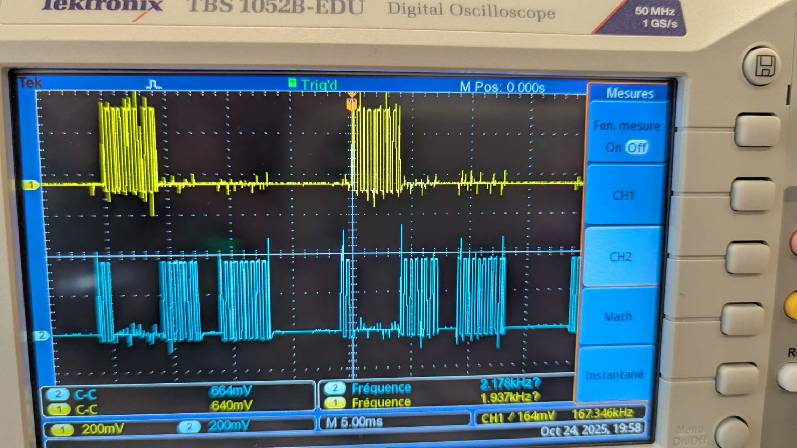
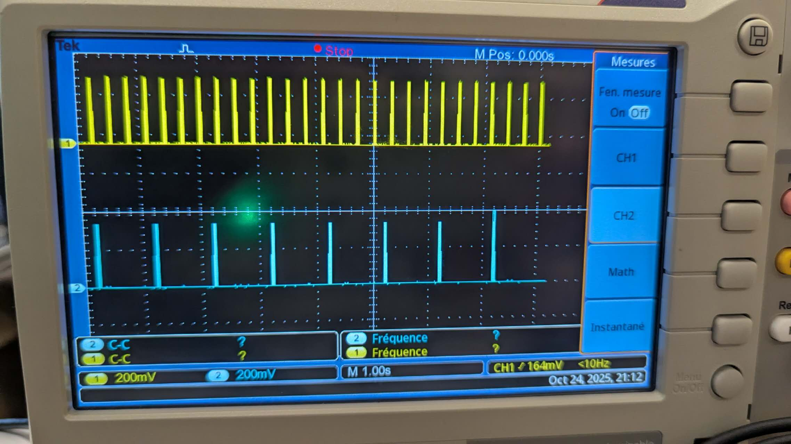

# Rapport d'expérimentation sur l'ordonnancement multitâche FreeRTOS

Ce rapport explore les mécanismes d'ordonnancement multitâche de FreeRTOS sur le microcontrôleur ESP32 double-cœur à travers une série d'expérimentations, comprenant la concurrence des tâches, la gestion des priorités, l'ordonnancement périodique, la synchronisation des tâches, le traitement des interruptions, la communication par files d'attente et la synchronisation par rendez-vous, démontrant systématiquement les concepts fondamentaux et les applications des systèmes d'exploitation temps réel.

---

## 2.1.1 Premier essai (Q21a)

### Analyse du code

Cette expérimentation utilise `xTaskCreate` pour créer deux tâches, chacune basculant continuellement sa broche GPIO respective. La tâche 1 est assignée à GPIO19 avec une priorité de 1 ; la tâche 2 est assignée à GPIO23 avec une priorité de 10. En utilisant `xTaskCreate` plutôt qu'une création avec affectation de cœur, l'ordonnanceur FreeRTOS distribue les deux tâches sur les différents cœurs de l'ESP32.

### Analyse graphique


*Figure 1 : Signaux GPIO en exécution parallèle sur cœurs différents*

**Observation graphique** : L'oscilloscope montre que les broches 19 et 23 génèrent toutes deux des signaux carrés d'environ 1000 kHz. Les deux signaux sont émis simultanément avec la même fréquence, indiquant que les deux tâches s'exécutent en parallèle sur des cœurs différents sans interférence mutuelle, même avec une grande différence de priorité, aucun phénomène de préemption ne se produit.

## 2.1.2 Deuxième essai (Q21b)

### Analyse du code

Cette expérimentation utilise `xTaskCreatePinnedToCore` pour lier les deux tâches au cœur 0, les forçant à concourir pour le temps CPU sur le même cœur. La tâche 1 a une priorité de 1, la tâche 2 a une priorité de 10. Lorsque deux tâches s'exécutent sur le même cœur avec des priorités différentes, la tâche de haute priorité occupera continuellement le CPU, empêchant la tâche de basse priorité de s'exécuter. Seulement lorsque les priorités sont identiques, le système permettra aux tâches de s'exécuter alternativement.

### Analyse graphique


*Figure 2 : Affamation de la tâche basse priorité en mono-cœur (premier test)*

**Observation graphique** : La fréquence du signal de la broche 19 est d'environ 1000 kHz, présentant une onde carrée dense, tandis que l'autre signal est presque une ligne plate. Cela indique que la tâche de haute priorité occupe continuellement le cœur 0, la tâche de basse priorité est "affamée", n'obtenant presque aucune opportunité d'exécution.


*Figure 3 : Confirmation de l'affamation en mono-cœur (deuxième test)*

**Observation graphique** : La forme d'onde est similaire au premier test, confirmant davantage l'effet de préemption par priorité dans un environnement mono-cœur. La tâche de basse priorité ne peut s'exécuter que pendant les instants très brefs où la tâche de haute priorité cède le CPU, avec presque aucune activité visible sur la forme d'onde.

## 2.2.2a Premier essai (Q22a)

### Analyse du code

Cette expérimentation apporte des améliorations clés par rapport à Q21b : les deux tâches sont liées à des cœurs différents (tâche 1 sur le cœur 0, tâche 2 sur le cœur 1), et un délai est ajouté après chaque série de 30000 basculements (tâche 1 délai 10ms, tâche 2 délai 20ms). L'allocation multi-cœurs élimine le problème de préemption par priorité, tandis que l'ajout de `vTaskDelay` permet aux tâches de céder périodiquement le CPU, réalisant un mode régulier "travail-repos".

### Analyse graphique


*Figure 4 : Motifs périodiques avec vTaskDelay (premier test)*

**Observation graphique** : Les deux signaux présentent une forme de train d'impulsions régulier, les signaux jaune et bleu montrant tous deux un rythme clair "travail-repos". Comme les deux tâches s'exécutent sur des cœurs différents, elles peuvent s'exécuter en parallèle sans interférence mutuelle, même avec des priorités différentes, toutes deux fonctionnent normalement.


*Figure 5 : Confirmation des motifs périodiques avec vTaskDelay (deuxième test)*

**Observation graphique** : La forme d'onde est cohérente avec le premier test, confirmant davantage le rôle de `vTaskDelay`. Bien que les deux tâches aient des priorités différentes, elles réalisent un ordonnancement équitable en cédant activement le CPU, évitant le phénomène de famine.

## 2.2.2b Deuxième essai (Q22b)

### Analyse du code

Cette expérimentation remplace `vTaskDelay` par `vTaskDelayUntil`, implémentant l'ordonnancement de tâches périodiques. `vTaskDelayUntil` garantit que la tâche s'exécute avec une période précise, sans accumulation d'erreurs dues aux fluctuations du temps d'exécution. Le nombre de basculements est réduit à 10000, rendant chaque cycle de travail plus court. Lorsque nIteration=10000, la différence de temps entre les deux signaux est difficile à observer ; mais après modification de la valeur nIterations, on peut clairement voir le délai de la tâche 2 causé par l'occupation de la tâche 1, bien que le cycle de signal suivant reste inchangé, sauf si l'itération est trop grande causant un chevauchement des signaux.

### Analyse graphique


*Figure 6 : Périodicité stricte avec vTaskDelayUntil (premier test)*

**Observation graphique** : Les deux signaux présentent des trains d'impulsions très réguliers, les impulsions de la tâche 1 (période 10ms) sont plus denses, les impulsions de la tâche 2 (période 20ms) sont légèrement plus espacées. L'ordonnancement périodique rend les intervalles de signal uniformément stables, sans phénomène de gigue ou de dérive.


*Figure 7 : Stabilité du contrôle périodique avec vTaskDelayUntil (deuxième test)*

**Observation graphique** : La forme d'onde reste cohérente avec le premier test, vérifiant la capacité de contrôle de période précise de `vTaskDelayUntil`. Même si la tâche 2 commence avec un délai dû à l'exécution de la tâche 1, sa périodicité reste garantie, reflétant la prévisibilité du système temps réel.

## 2.3 Synchronisation et communication inter-tâches

### 2.3.2 Expérimentation 1 - Synchronisation par sémaphore binaire (Q23a)

#### Analyse du code

Cette expérimentation démontre la synchronisation directe entre tâches utilisant un sémaphore binaire (Binary Semaphore). Le programme crée deux tâches :
- **vTask1** : Tâche périodique, exécute un basculement GPIO toutes les 10ms, après achèvement libère le sémaphore via `xSemaphoreGive()`, équivalant à envoyer un signal "j'ai terminé" à la tâche 2
- **vTask2** : Attend continuellement le sémaphore via `xSemaphoreTake()`, ne peut acquérir et exécuter son propre basculement GPIO que lorsque la tâche 1 libère le sémaphore

Ce mécanisme est similaire à un modèle "starter-athlète" : la tâche 1 lève le drapeau après chaque cycle de travail, la tâche 2 commence l'action après avoir vu le signal, assurant ainsi que l'action de la tâche 2 se produit toujours après une action de la tâche 1, réalisant un contrôle strict de l'ordre d'exécution.

#### Analyse graphique


*Figure 8 : Synchronisation stricte entre tâches avec sémaphore binaire*

**Observation graphique** : L'oscilloscope montre deux trains d'impulsions clairs. CH1 (jaune) montre les impulsions périodiques de la tâche 1, chaque impulsion correspondant à un cycle complet de basculement GPIO. CH2 (bleu) montre les impulsions de la tâche 2, dont l'apparition suit toujours immédiatement les impulsions de la tâche 1, avec une relation temporelle évidente de dépendance. Un délai temporel fixe peut être observé entre les deux signaux, c'est la manifestation du mécanisme de synchronisation par sémaphore.

**Analyse de l'effet de synchronisation** : D'après la forme d'onde, on peut voir que la tâche 2 ne s'exécute jamais avant la tâche 1, ni en parallèle avec la tâche 1. Chaque fois que la tâche 1 termine un cycle de travail et libère le sémaphore, la tâche 2 est immédiatement réveillée et commence à s'exécuter, puis entre à nouveau dans l'état d'attente après achèvement. Ce cycle "attente-réveil-exécution-attente" assure une synchronisation stricte entre les deux tâches, reflétant le rôle du sémaphore binaire dans la collaboration des tâches.

### 2.3.3 Expérimentation 2 - Protection des ressources partagées par mutex (Q23b)

#### Analyse du code

Cette expérimentation démontre le problème de condition de course (Race Condition) dans un environnement multitâche pour les ressources partagées et sa solution. Le programme crée deux tâches vTask1 et vTask2, qui appellent toutes deux la même fonction `alternate()` pour opérer la sortie GPIO. Cette fonction est considérée comme une "ressource partagée", si deux tâches y accèdent simultanément, cela entraînera un désordre de la forme d'onde de sortie.

L'expérimentation est divisée en deux phases :
1. **Première phase** : Les `xSemaphoreTake()` et `xSemaphoreGive()` du mutex sont commentés, les deux tâches peuvent accéder à la ressource partagée de manière désordonnée
2. **Deuxième phase** : Les commentaires du code mutex sont supprimés, chaque tâche doit d'abord acquérir le mutex avant d'entrer dans la section critique, le libérer après utilisation, garantissant qu'une seule tâche peut accéder à la ressource partagée à un moment donné

#### Analyse graphique - Première phase (sans protection mutex)


*Figure 9 : Accès concurrent non protégé à la ressource partagée*

**Observation graphique** : La forme d'onde affichée par l'oscilloscope présente des caractéristiques de désordre évidentes. Le train d'impulsions CH1 (jaune) montre une densité inégale à l'intérieur, certaines zones ont des impulsions manifestement clairsemées. La distribution des impulsions CH2 (bleu) est également très irrégulière, tantôt dense tantôt clairsemée. Les deux signaux se chevauchent et s'entrelacent dans le temps, incapables de former une division claire des cycles de travail.

**Analyse de la condition de course** : Cette forme d'onde chaotique est la manifestation typique d'une condition de course. Lorsque deux tâches appellent la fonction `alternate()` presque simultanément, leurs opérations GPIO interfèrent mutuellement. Par exemple, la tâche 1 peut venir de mettre la broche à l'état haut, la tâche 2 la met immédiatement à l'état bas, perturbant le cycle de basculement prévu. D'après la forme d'onde, les impulsions qui devraient être régulières deviennent imprévisibles, prouvant qu'en l'absence de mécanisme de synchronisation, l'accès aux ressources partagées n'est pas sûr.

#### Analyse graphique - Deuxième phase (protection mutex)


*Figure 10 : Accès mutuellement exclusif avec protection mutex*

**Observation graphique** : Après ajout de la protection mutex, la forme d'onde subit un changement significatif. Les trains d'impulsions CH1 (jaune) et CH2 (bleu) deviennent tous deux très réguliers et denses, chaque largeur d'impulsion est cohérente, les intervalles sont uniformes. Les deux signaux présentent un mode clair de "travail alterné" : pendant une certaine période CH1 est actif, ensuite CH2 est actif, il n'y a plus de chevauchement ou d'entrelacement entre eux. La forme d'onde globale présente une périodicité claire et une prévisibilité.

**Analyse de l'effet mutex** : Le mutex transforme avec succès l'accès concurrent en accès séquentiel. Lorsque la tâche 1 acquiert le mutex et entre dans la section critique de la fonction `alternate()`, la tâche 2 doit attendre même si elle est prête. Ce n'est que lorsque la tâche 1 termine le travail et libère le mutex que la tâche 2 peut acquérir le verrou et entrer dans la section critique. Ce mécanisme de "file d'attente" élimine la condition de course, garantit que chaque tâche peut exécuter complètement ses opérations GPIO sans interruption, rendant ainsi la forme d'onde ordonnée.

#### Résumé comparatif

| Caractéristique | Sans protection mutex (Première phase) | Protection mutex (Deuxième phase) |
|------|------------------------|---------------------|
| Régularité de la forme d'onde | Chaotique, imprévisible | Régulière, périodicité forte |
| Mode d'exécution des tâches | Accès concurrent, interférence mutuelle | Accès séquentiel, non-interférence |
| Sécurité des ressources partagées | Unsafe, existence de condition de course | Sûr, section critique protégée |
| Fiabilité du système | Faible, sortie indéterminée | Élevée, sortie déterminée et contrôlable |

**Rôle de la modification** : Supprimer les commentaires du code mutex implémente la protection d'accès mutuel aux ressources partagées. Le mutex garantit l'exécution atomique du code de section critique, prévient les problèmes de compétition de données et d'incohérence dans un environnement multitâche, c'est le moyen fondamental pour garantir la correction du système en programmation multitâche.

### 2.3.4 Expérimentation 3 - Inversion de priorité et héritage de priorité (Q23c)

#### Analyse du code

Cette expérimentation démontre un problème important et dangereux dans les systèmes temps réel : **l'inversion de priorité** (Priority Inversion), ainsi que la méthode de FreeRTOS pour résoudre ce problème via le mécanisme **d'héritage de priorité** (Priority Inheritance).

Le programme crée trois tâches, toutes exécutées sur le cœur 0 :
- **vTaskBasse** (basse priorité, priorité 1) : Nécessite l'accès à une ressource partagée, temps d'exécution plus long
- **vTaskInter** (priorité moyenne, priorité 5) : N'accède pas à la ressource partagée, mais préemptera la tâche de basse priorité
- **vTaskHaute** (haute priorité, priorité 10) : Nécessite l'accès à la même ressource partagée que la tâche de basse priorité

L'expérimentation est divisée en deux phases :
1. **Première phase** : Utilise le sémaphore binaire `xSemaphoreCreateBinary()` comme mécanisme de verrouillage
2. **Deuxième phase** : Remplace par le mutex `xSemaphoreCreateMutex()`, active l'héritage de priorité

#### Sortie Serial Monitor - Première phase (Binary Semaphore)

```
Travaille sur : BASSE_PARTAGEE
La tâche priorité BASSE a fini son travail avec la ressource partagée
La tâche priorité BASSE a fini son travail en : 2187 ms
La tâche priorité HAUTE accède à la ressource partagée
Travaille sur : HAUTE_PARTAGEE
...
La tâche priorité HAUTE a fini son travail en : 1915 ms
Travaille sur : INTERMEDIAIRE
La tâche priorité HAUTE souhaite acceder à la ressource partagée
Travaille sur : INTERMEDIAIRE
Travaille sur : INTERMEDIAIRE
Travaille sur : INTERMEDIAIRE
Travaille sur : INTERMEDIAIRE
Travaille sur : INTERMEDIAIRE
La tâche priorité INTERMEDIAIRE a fini son travail en : 1214 ms
Travaille sur : BASSE_PARTAGEE
...
```

**Analyse du flux d'exécution** :

1. **Phase initiale** : La tâche de basse priorité acquiert le sémaphore et commence à accéder à la ressource partagée ("BASSE_PARTAGEE"), durée 2187ms
2. **Première tâche de haute priorité** : Lorsque la tâche de basse priorité libère la ressource, la tâche de haute priorité l'acquiert immédiatement et s'exécute, durée 1915ms
3. **Problème clé apparaît** : Lorsque la tâche de haute priorité veut à nouveau accéder à la ressource partagée ("La tâche priorité HAUTE souhaite acceder à la ressource partagée"), à ce moment la tâche de basse priorité détient le sémaphore, mais la tâche de priorité moyenne (INTERMEDIAIRE) préempte le CPU car sa priorité est supérieure à celle de la tâche de basse priorité
4. **Inversion de priorité** : La tâche de haute priorité doit attendre l'achèvement de la tâche de priorité moyenne (1214ms), puis attendre l'achèvement de la tâche de basse priorité (2187ms), temps d'attente total dépassant 3400ms. En réalité, la tâche de haute priorité est bloquée par deux tâches de priorité inférieure !

**Essence du problème** : Le sémaphore binaire ne supporte pas l'héritage de priorité. Lorsque la tâche de haute priorité attend le verrou, la priorité de la tâche de basse priorité détenant le verrou ne sera pas élevée, elle sera donc préemptée par la tâche de priorité moyenne, entraînant un allongement inutile du temps d'attente de la tâche de haute priorité.

#### Sortie Serial Monitor - Deuxième phase (Mutex with Priority Inheritance)

```
Travaille sur : INTERMEDIAIRE
La tâche priorité HAUTE souhaite acceder à la ressource partagée
Travaille sur : BASSE_PARTAGEE
Travaille sur : BASSE_PARTAGEE
Travaille sur : BASSE_PARTAGEE
Travaille sur : BASSE_PARTAGEE
Travaille sur : BASSE_PARTAGEE
La tâche priorité BASSE a fini son travail avec la ressource partagée
La tâche priorité BASSE a fini son travail en : 1472 ms
La tâche priorité HAUTE accède à la ressource partagée
Travaille sur : HAUTE_PARTAGEE
...
La tâche priorité HAUTE a fini son travail en : 1200 ms
Travaille sur : INTERMEDIAIRE
Travaille sur : INTERMEDIAIRE
...
La tâche priorité INTERMEDIAIRE a fini son travail en : 2405 ms
```

**Analyse du flux d'exécution** :

1. **Début de la tâche de priorité moyenne** : La tâche INTERMEDIAIRE commence à s'exécuter
2. **Requête de ressource par la tâche de haute priorité** : La tâche de haute priorité veut accéder à la ressource partagée, mais à ce moment la tâche de basse priorité détient le mutex
3. **Activation de l'héritage de priorité** : Changement clé ! Lorsque la tâche de haute priorité est bloquée sur le mutex, le système élève automatiquement la priorité de la tâche de basse priorité temporairement au même niveau que la tâche de haute priorité (priorité 10)
4. **Continuation de l'exécution de la tâche de basse priorité** : En raison de l'élévation de priorité, la tâche de basse priorité n'est plus préemptée par la tâche de priorité moyenne, peut exécuter continuellement son code de section critique ("BASSE_PARTAGEE" apparaît 5 fois consécutives), durée 1472ms
5. **Exécution immédiate de la tâche de haute priorité** : Après que la tâche de basse priorité libère le verrou, la tâche de haute priorité l'acquiert immédiatement et s'exécute, durée 1200ms
6. **Reprise de la tâche de priorité moyenne** : Finalement la tâche de priorité moyenne continue et termine l'exécution, durée 2405ms

**Effet d'optimisation** : Le temps d'attente total de la tâche de haute priorité passe de 3400ms à environ 1472ms, réduisant le délai d'environ 57% !

#### Résumé comparatif

| Caractéristique | Binary Semaphore (Première phase) | Mutex with Priority Inheritance (Deuxième phase) |
|------|---------------------------|----------------------------------------|
| Héritage de priorité | Non supporté | Supporté |
| Temps d'attente de la tâche haute priorité | ~3400ms (INTER+BASSE) | ~1472ms (seulement BASSE) |
| Exécution de la tâche basse priorité | Fréquemment préemptée par la tâche priorité moyenne | Exécution continue après héritage haute priorité |
| Comportement de la tâche priorité moyenne | Préempte lorsque la tâche basse priorité détient le verrou | Bloquée après que la basse priorité hérite de la haute priorité |
| Problème d'inversion de priorité | Sévère (haute priorité ineffective) | Résolu (haute priorité garantie) |
| Temps réel du système | Mauvais, imprévisible | Bon, conforme à la conception de priorité |

#### Explication de la modification du code

**Contenu de la modification** : Dans la fonction `setup()`, remplacer
```cpp
xSemaphore = xSemaphoreCreateBinary();
```
par
```cpp
xSemaphore = xSemaphoreCreateMutex();
```

**Rôle de la modification** :

1. **Niveau sémantique** : Le mutex (Mutex) indique clairement son usage pour protéger l'accès mutuel aux ressources partagées, tandis que le sémaphore binaire est davantage utilisé pour la transmission de signaux de synchronisation entre tâches, l'utilisation de la primitive de synchronisation correcte améliore la lisibilité et la maintenabilité du code

2. **Niveau fonctionnel** : Le mutex intègre le protocole d'héritage de priorité. Lorsqu'une tâche de haute priorité est bloquée en attendant le mutex, le noyau élève automatiquement la priorité de la tâche de basse priorité détenant le verrou temporairement au niveau de la priorité la plus élevée des tâches en attente, garantissant que la tâche de basse priorité puisse terminer rapidement le code de section critique et libérer le verrou

3. **Garantie du temps réel** : Le mécanisme d'héritage de priorité prévient le problème d'inversion de priorité, garantit que le temps de réponse de la tâche de haute priorité est conforme aux attentes, ce qui est crucial pour la prévisibilité et la fiabilité du système temps réel

4. **Utilisation des ressources** : En réduisant le temps de blocage de la tâche de haute priorité, la performance de réponse globale du système et l'efficacité d'utilisation des ressources sont toutes deux améliorées

**Conclusion** : Dans les systèmes temps réel multitâches, lorsqu'il est nécessaire de protéger des ressources partagées, il convient de privilégier l'utilisation du mutex plutôt que du sémaphore binaire, afin d'éviter les problèmes d'inversion de priorité. C'est l'un des principes importants de conception des systèmes d'exploitation temps réel.

## 2.4 Interruptions et coopération des tâches (Q24)

### 2.4.1 Analyse du code

Cette expérimentation démontre le mécanisme de coopération entre les interruptions matérielles et les tâches. Le programme crée deux tâches et une routine de service d'interruption. Le système utilise un sémaphore binaire pour connecter les interruptions et les tâches.

**Connexion matérielle** :
- GPIO12 (broche de sortie) est connectée via un fil à GPIO5 (broche d'entrée d'interruption)
- Le programme bascule l'état de GPIO12 toutes les 300ms dans setup
- GPIO5 déclenche une interruption lors de la détection d'un changement de niveau

**Configuration des tâches** :
- **vTask1** : S'exécute sur le cœur 0, priorité 20, effectue un basculement GPIO toutes les 1000ms (10 itérations, 5ms chacune)
- **vTask2** : S'exécute sur le cœur 1, priorité 10, attend que le sémaphore soit libéré puis effectue un basculement GPIO

**Flux de travail** :
1. La fonction setup entre dans une boucle infinie, bascule la sortie de GPIO12 toutes les 300ms
2. GPIO5 détecte un changement de niveau (front montant ou descendant), déclenche la routine d'interruption
3. La routine d'interruption appelle `xSemaphoreGiveFromISR()` pour libérer le sémaphore
4. La tâche 2 acquiert le sémaphore via `xSemaphoreTake()`, est réveillée et exécute le travail
5. La tâche 1 s'exécute indépendamment, non affectée par le système d'interruption

### 2.4.2 Analyse graphique


*Figure 11 : Coopération entre interruption matérielle et tâches via sémaphore*

**Observation graphique** :
- **CH1 (jaune, Tâche1)** : Affiche un train d'impulsions régulier, chaque train d'impulsions d'environ 100ms de largeur (10 fois × 10ms), intervalle de 1 seconde
- **CH2 (bleu, Tâche2)** : Affiche des impulsions plus denses, fréquence d'apparition d'environ une tous les 150ms
- **Échelle temporelle** : 1 seconde/division (1.00s/div)

**Analyse du timing d'exécution** :

GPIO12 bascule son état toutes les 300ms. Le mode de déclenchement d'interruption est réglé sur `CHANGE` (déclenchement sur changement de niveau). Cela signifie que deux événements d'interruption se produisent toutes les 300ms :
- t=0ms : GPIO12 passe de bas à haut, déclenche une interruption sur front montant
- t=150ms : Après une demi-période
- t=300ms : GPIO12 passe de haut à bas, déclenche une interruption sur front descendant
- t=450ms : Après une demi-période
- t=600ms : GPIO12 passe de bas à haut, déclenche à nouveau une interruption

Donc la tâche 2 est en fait réveillée environ toutes les 150ms. Les impulsions denses visibles sur la forme d'onde vérifient ce timing.

### 2.4.3 Sortie Serial Monitor

```
[INFO] current=1 et in=1
[INFO] interruptRoutine()
[INFO] vTask2 called
[INFO] current=0 et in=0
[INFO] interruptRoutine()
[INFO] vTask2 called
[INFO] current=1 et in=1
[INFO] interruptRoutine()
[INFO] vTask2 called
```

**Analyse de la sortie** :

Chaque fois que l'état de GPIO12 change (changement de la valeur current), le système imprime immédiatement trois informations :
1. `current=X et in=X` : Affiche que l'état de sortie et l'état de détection d'entrée sont cohérents
2. `[INFO] interruptRoutine()` : La routine d'interruption est déclenchée
3. `[INFO] vTask2 called` : La tâche 2 est réveillée et commence à s'exécuter

Ces trois informations sont étroitement liées. Elles illustrent que le changement de niveau, le déclenchement d'interruption et le réveil de tâche constituent un processus continu.

### 2.4.4 Résumé du principe de fonctionnement

**Principe de conception de la routine de service d'interruption** :

La routine d'interruption doit s'exécuter aussi rapidement que possible. Elle ne peut pas contenir de logique de traitement complexe. Par conséquent, la meilleure pratique est :
1. La routine d'interruption est seulement responsable de libérer le sémaphore
2. Le vrai travail est effectué dans la tâche normale
3. La tâche est réveillée par l'interruption en attendant le sémaphore

**Priorité et allocation de cœur** :

La priorité de la tâche 1 (20) est supérieure à celle de la tâche 2 (10). Mais cette différence ne pose pas de problème. La raison est que les deux tâches s'exécutent sur des cœurs différents. La tâche 1 est sur le cœur 0, la tâche 2 sur le cœur 1. Elles s'exécutent indépendamment, sans interférence mutuelle.

**Signification du mécanisme de réponse aux interruptions** :

Les systèmes embarqués doivent répondre aux événements externes. Le moment de ces événements est imprévisible. Le mécanisme d'interruption permet au CPU de répondre immédiatement à ces événements. Le sémaphore transmet la notification d'interruption à la tâche, permettant à la tâche de traiter l'événement au moment approprié.

## 2.5 Communication par files d'attente (Q25)

### 2.5.1 Analyse du code

Cette expérimentation démontre la communication par file d'attente entre plusieurs producteurs et un consommateur. Le programme crée deux tâches d'envoi et une tâche de réception. Ils échangent des données via une file d'attente.

**Configuration de la file d'attente** :
- Capacité de la file : 5 éléments (`TAILLE_MAX = 5`)
- Type de données : entier (`sizeof(int)`)
- Fonction de création : `xQueueCreate(TAILLE_MAX, sizeof(int))`

**Configuration des tâches** :
- **vSenderTask (Sender1)** : Priorité 1, envoie la valeur fixe 100
- **vSenderTask (Sender2)** : Priorité 1, envoie la valeur fixe 200
- **vReceiverTask (Receiver)** : Priorité 2, reçoit et imprime les données

**Flux de travail** :
1. Les deux tâches d'envoi appellent continuellement `xQueueSendToBack()` pour envoyer des données, timeout 0
2. Si la file n'est pas pleine, l'envoi réussit et imprime "envoyé = X"
3. Si la file est pleine, imprime "envoyé = aucun"
4. La tâche de réception appelle `uxQueueMessagesWaiting()` pour voir le nombre d'éléments dans la file
5. La tâche de réception appelle `xQueueReceive()` pour lire les données, timeout 100ms
6. Si la file contient des données, imprime "lu = X" ; sinon imprime "lu = aucun"

### 2.5.2 Sortie Serial Monitor

```
vSenderTask - envoyé = 100 (priorite 1)
vReceiverTask - lu = 100 (priorite 2)
vReceiverTask - nb elements = 0 (priorite 2)
vSenderTask - envoyé = 100 (priorite 1)
vSenderTask - envoyé = 200 (priorite 1)
vReceiverTask - lu = 100 (priorite 2)
vReceiverTask - nb elements = 1 (priorite 2)
vReceiverTask - lu = 200 (priorite 2)
vReceiverTask - nb elements = 0 (priorite 2)
vSenderTask - envoyé = 200 (priorite 1)
vReceiverTask - lu = 200 (priorite 2)
```

**Analyse de la sortie** :

La priorité de la tâche de réception (2) est supérieure à celle des tâches d'envoi (1). Cela signifie que tant que la file contient des données, la tâche de réception sera immédiatement réveillée et préemptera les tâches d'envoi. On peut voir dans la sortie :
1. Lorsque la file est vide (nb elements = 0), les deux tâches d'envoi se disputent le CPU
2. Dès que des données sont mises en file, la tâche de réception préempte immédiatement et lit les données
3. La file reste la plupart du temps à 0 ou 1 élément

### 2.5.3 Analyse de la priorité et de l'ordonnancement

**Raison de la priorité plus élevée de la tâche de réception** :

La priorité de la tâche de réception (2) est supérieure à celle des tâches d'envoi (1). Cette conception garantit que les données peuvent être traitées en temps opportun. Si la priorité de la tâche de réception était basse, la file pourrait rapidement se remplir, entraînant le blocage des tâches d'envoi ou la perte de données.

**Rôle tampon de la file** :

La capacité de la file est de 5. Même si la tâche de réception ne peut pas traiter les données pendant une courte période, la file peut stocker temporairement jusqu'à 5 données. Cela offre une certaine capacité de tolérance aux pannes. D'après la sortie, le nombre d'éléments de la file fluctue entre 0 et 1, indiquant que la vitesse de réception est suffisamment rapide.

### 2.5.4 Conclusion

La file d'attente est un mécanisme important pour implémenter la communication entre tâches dans FreeRTOS. Cette expérimentation montre le modèle multi-producteurs mono-consommateur. La file offre un transfert de données thread-safe, combiné au mécanisme de priorité, elle peut réaliser un contrôle efficace du flux de données.

## 2.6 Synchronisation par point de rendez-vous (Q26)

### 2.6.1 Exigences de l'expérimentation

Cette expérimentation requiert l'implémentation d'un mécanisme de synchronisation par point de rendez-vous entre trois tâches. Les tâches 1 et 2 exécutent leurs travaux respectifs en parallèle, la tâche 3 doit attendre que les deux premières tâches soient terminées avant de commencer son exécution.

### 2.6.2 Implémentation du code

Le programme utilise un sémaphore de comptage `xSemaphoreCreateCounting(2, 0)` pour implémenter la synchronisation. Les tâches 1 et 2 appellent chacune `xSemaphoreGive()` pour libérer le sémaphore après avoir terminé leur travail, la tâche 3 appelle deux fois consécutives `xSemaphoreTake()` pour attendre les signaux de complétion des deux premières tâches. Les trois tâches sont liées aux broches GPIO (23, 19, 18), permettant d'observer leur ordre d'exécution avec un oscilloscope.

### 2.6.3 Conclusion

Le sémaphore de comptage offre un mécanisme flexible de synchronisation multitâche. Ce modèle de point de rendez-vous est adapté aux scénarios nécessitant l'agrégation des résultats de plusieurs tâches parallèles, comme la fusion de données multi-capteurs ou les points de synchronisation dans le calcul distribué.

---

## Conclusion

À travers cette expérimentation, nous avons systématiquement maîtrisé les mécanismes fondamentaux de FreeRTOS : comprendre la nature de l'ordonnancement des tâches à partir du parallélisme multi-cœurs et de la préemption par priorité, réaliser un contrôle périodique précis grâce aux fonctions de délai, résoudre les problèmes de synchronisation et de communication des tâches en utilisant les sémaphores, les mutex et les files d'attente, et implémenter la réponse en temps réel aux événements externes via le mécanisme d'interruption, ces technologies constituent la base du développement de systèmes embarqués temps réel.
