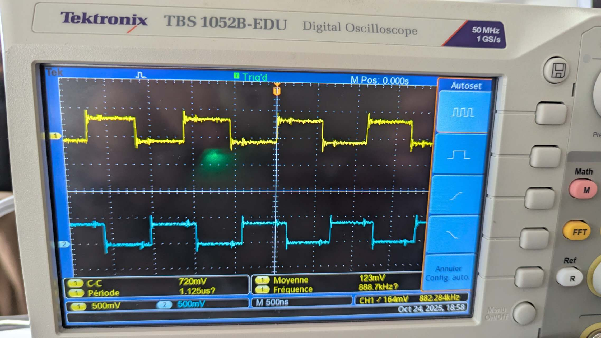
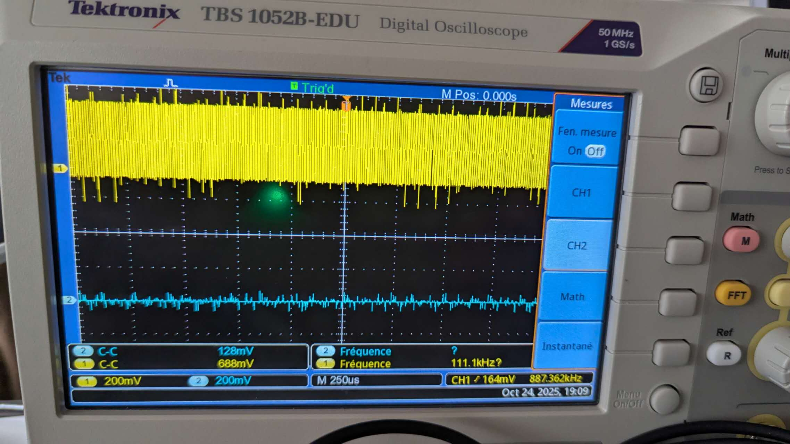
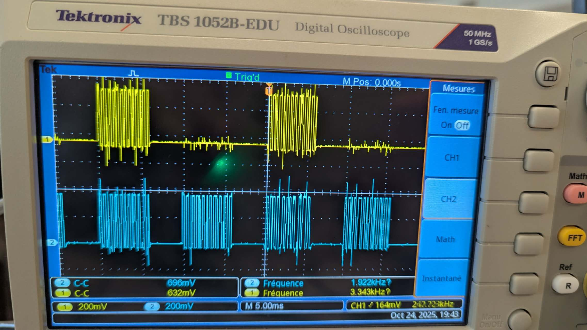

# Rapport de TP1 - Gestion des tâches sous FreeRTOS

**Date:** 24 octobre 2025
**Objectif:** Étude pratique de l'ordonnancement des tâches FreeRTOS sur ESP32, observation des effets de la priorité et du multitâche sur architectures multi-cœurs

---

## 1. Introduction

Ce rapport présente nos expérimentations sur le système d'exploitation temps réel FreeRTOS, déployé sur un microcontrôleur ESP32 dual-core. L'objectif principal est de comprendre les mécanismes d'ordonnancement des tâches, en particulier :

- L'effet de la priorité des tâches sur l'allocation du CPU
- La différence entre l'exécution mono-cœur et multi-cœurs
- L'impact des mécanismes de blocage (`vTaskDelay`, `vTaskDelayUntil`) sur l'équité de l'ordonnancement
- Les caractéristiques des tâches périodiques dans un contexte temps réel

Pour visualiser le comportement du système, nous avons utilisé un oscilloscope digital (Tektronix TBS 1052B-EDU) permettant de capturer simultanément deux signaux GPIO générés par nos tâches. Les tâches testées effectuent des basculements rapides de niveau logique sur des broches GPIO, créant des signaux carrés dont la fréquence et la régularité reflètent directement l'activité de chaque tâche.

**Convention de couleurs sur l'oscilloscope :**
- **Jaune (CH1)** : Tâche 1
- **Bleu/Cyan (CH2)** : Tâche 2

---

## 2. Q21a - Ordonnancement multi-cœurs avec priorités différentes

### 2.1 Configuration

**Code:** `IF4_TP1_Q21a.ino`

**Paramètres clés :**
- Tâche 1 : GPIO19, priorité 1, créée avec `xTaskCreate`
- Tâche 2 : GPIO23, priorité 10, créée avec `xTaskCreate`
- Les deux tâches exécutent une boucle infinie de basculement GPIO sans délai

**Mécanisme d'ordonnancement :**
Avec `xTaskCreate`, le planificateur de FreeRTOS a la liberté d'allouer chaque tâche au cœur de son choix. Sur l'ESP32 (architecture dual-core), le système peut répartir les tâches sur les deux cœurs disponibles (core 0 et core 1).

### 2.2 Résultats observés

*Figure 1 : Q21a - Exécution multi-cœurs (échelle temporelle : 500 ns/div)*

**Analyse de la figure 1 :**

L'oscilloscope nous montre deux signaux carrés bien formés :
- **Signal jaune (CH1)** : Basculements réguliers à haute fréquence, période d'environ 1.125 µs, amplitude 720 mV
- **Signal bleu (CH2)** : Basculements réguliers à haute fréquence également, fréquence mesurée à 888.7 kHz

**Observations importantes :**
1. Les deux tâches génèrent des signaux carrés denses et réguliers
2. Malgré une différence de priorité importante (1 vs 10), aucune tâche n'est affamée
3. Les deux signaux coexistent avec des fréquences élevées et stables

### 2.3 Interprétation

Ce résultat confirme que le planificateur a affecté les deux tâches à des cœurs différents. Dans cette configuration :
- La **Tâche 1** (priorité 1) s'exécute sur un cœur (probablement core 0)
- La **Tâche 2** (priorité 10) s'exécute sur l'autre cœur (probablement core 1)

Puisque chaque tâche dispose de son propre cœur, la différence de priorité n'a aucun impact : il n'y a pas de compétition pour le CPU. Les deux tâches tournent en parallèle à pleine vitesse, chacune monopolisant son cœur puisqu'elles ne contiennent aucun appel bloquant.

**Conclusion Q21a :** L'architecture multi-cœurs de l'ESP32 permet l'exécution véritablement parallèle de plusieurs tâches. La priorité n'entre en jeu que lorsque plusieurs tâches se disputent le même cœur.

---

## 3. Q21b - Ordonnancement mono-cœur avec priorités différentes

### 3.1 Configuration

**Code:** `IF4_TP1_Q21b.ino`

**Paramètres clés :**
- Tâche 1 : GPIO23, priorité 1, épinglée au core 0 avec `xTaskCreatePinnedToCore`
- Tâche 2 : GPIO19, priorité 10, épinglée au core 0 avec `xTaskCreatePinnedToCore`
- Chaque tâche effectue 1000 basculements GPIO en boucle infinie, sans délai
- Conservation des handles de tâches (`Task1`, `Task2`) pour contrôles futurs

**Différences par rapport à Q21a :**
- Les deux tâches sont **forcées sur le même cœur (core 0)**
- Les affectations GPIO sont inversées (GPIO23 pour Tâche1, GPIO19 pour Tâche2)
- Ajout d'une boucle interne de 1000 itérations

### 3.2 Résultats observés

#### Test 1 : Affamation claire de la tâche à basse priorité

*Figure 2 : Q21b Test 1 - Phénomène d'affamation (échelle temporelle : 250 µs/div)*

**Analyse de la figure 2 :**

Cette capture d'écran illustre de manière spectaculaire le phénomène d'**affamation (starvation)** :

- **Signal jaune (CH1 - Tâche 1, priorité 1)** : Occupe toute la largeur de l'écran avec des basculements extrêmement denses et rapides. Le signal remplit complètement sa zone, montrant une activité intense et continue.

- **Signal bleu (CH2 - Tâche 2, priorité 10)** : Apparaît comme une **ligne quasi-plate** proche du niveau bas, avec seulement de minuscules fluctuations ou du bruit. Aucun basculement significatif n'est visible.

**Mesures :**
- CH1 (jaune) : 888 mV, activité continue
- CH2 (bleu) : Fréquence affichée 111.1 kHz mais visuellement presque aucune activité

**Interprétation :** La tâche à haute priorité (Tâche 2, bleu) monopolise complètement le CPU. La tâche à basse priorité (Tâche 1, jaune) est presque totalement affamée et ne parvient à s'exécuter que lors de micro-instants, probablement lorsque la tâche haute priorité termine une boucle de 1000 itérations et redémarre.

#### Test 2 : Alternance visible des phases d'exécution

*Figure 3 : Q21b Test 2 - Alternance des périodes d'activité (échelle temporelle : 250 µs/div)*

**Analyse de la figure 3 :**

Cette deuxième capture montre un comportement légèrement différent :

- **Signal jaune (CH1)** : Présente des **blocs denses de basculements** alternant avec des zones plates. On observe une activité intense sur la partie gauche et centrale, puis une accalmie à droite.

- **Signal bleu (CH2)** : Sur la partie gauche, on observe un **bloc très dense de basculements rapides**, puis l'activité devient beaucoup plus sporadique et irrégulière.

**Mesures :**
- CH1 : 704 mV
- CH2 : Fréquences de 110.8 kHz et 124.8 kHz (variables)

**Interprétation :** Cette capture illustre le découpage temporel de l'exécution. On peut distinguer :
- Des **phases où la Tâche 2** (haute priorité, bleu) s'exécute intensément (bloc dense à gauche)
- Des **phases où la Tâche 1** (basse priorité, jaune) arrive à prendre le CPU

Cependant, la distribution du temps CPU reste très inégale : la tâche haute priorité obtient bien plus de temps processeur.

### 3.3 Interprétation globale de Q21b

**Mécanisme observé :**

Lorsque deux tâches sans appel bloquant sont épinglées au même cœur avec des priorités différentes, FreeRTOS applique strictement la **préemption basée sur la priorité** :

1. La **tâche haute priorité (priorité 10)** est presque toujours prête à s'exécuter
2. Elle préempte systématiquement la tâche basse priorité dès qu'elle est en état READY
3. La **tâche basse priorité (priorité 1)** ne s'exécute que dans les rares moments où la tâche haute priorité n'est pas prête

Bien que chaque tâche contienne une boucle de 1000 itérations, cette boucle s'exécute très rapidement (quelques microsecondes). À la fin de la boucle, la tâche recommence immédiatement, restant en état READY et monopolisant le CPU.

**Phénomène d'affamation :** La tâche basse priorité est **affamée (starved)** : elle obtient si peu de temps CPU qu'elle ne peut pratiquement pas progresser. Sur l'oscilloscope, son signal reste presque plat.

**Conclusion Q21b :**
- En configuration mono-cœur, la priorité devient déterminante
- Sans mécanisme de blocage volontaire, une tâche haute priorité peut monopoliser le CPU
- L'affamation des tâches basses priorités est un risque réel dans les systèmes temps réel mal configurés
- Il est indispensable d'introduire des appels bloquants (`vTaskDelay`, `vTaskDelayUntil`) pour partager équitablement le CPU

---

## 4. Q22a - Introduction des délais et ordonnancement multi-cœurs

### 4.1 Configuration

**Code:** `IF4_TP1_Q22a.ino`

**Paramètres clés :**
- Tâche 1 : GPIO23, priorité 1, épinglée au **core 0**, période 10 ms
- Tâche 2 : GPIO19, priorité 10, épinglée au **core 1**, période 20 ms
- Chaque tâche effectue 30000 basculements GPIO, puis appelle `vTaskDelay`
- Ajout de périodes configurables (`task1_period = 10 ms`, `task2_period = 20 ms`)

**Nouveautés :**
1. **Affectation à des cœurs différents** : Core 0 pour Tâche 1, Core 1 pour Tâche 2
2. **Appel bloquant `vTaskDelay`** : Après chaque série de basculements, la tâche se met volontairement en sommeil
3. **Augmentation du nombre de basculements** : 30000 au lieu de 1000

### 4.2 Résultats observés

#### Test 1 : Motifs périodiques réguliers

*Figure 4 : Q22a Test 1 - Tâches périodiques avec vTaskDelay (échelle temporelle : 25 ms/div)*

**Analyse de la figure 4 :**

L'oscilloscope révèle un changement radical par rapport à Q21b :

- **Signal jaune (CH1 - Tâche 1)** : Présente des **rafales périodiques** de basculements haute fréquence, alternant avec des périodes de repos. Le motif "activité intense - repos - activité intense" se répète régulièrement.

- **Signal bleu (CH2 - Tâche 2)** : Affiche également des **rafales périodiques** de basculements, avec un motif similaire mais pas nécessairement synchronisé avec le signal jaune.

**Mesures :**
- CH1 (jaune) : Fréquence globale 2.000 kHz
- CH2 (bleu) : Fréquence globale 1.961 kHz
- Échelle temporelle : 25 ms/division

**Structure d'une période :**
1. **Phase active** : Bloc dense de basculements rapides (correspondant aux 30000 itérations)
2. **Phase de repos** : Signal plat (correspondant au `vTaskDelay`)
3. Répétition du cycle

#### Test 2 : Confirmation du comportement périodique

*Figure 5 : Q22a Test 2 - Confirmation des motifs périodiques (échelle temporelle : 25 ms/div)*

**Analyse de la figure 5 :**

Cette seconde capture confirme les observations du Test 1 :

- Les deux signaux présentent des **rafales périodiques bien définies**
- Les périodes de repos sont clairement visibles entre chaque rafale
- Le motif est stable et reproductible

**Mesures :**
- CH1 (jaune) : Fréquence 2.000 kHz, tension 696 mV
- CH2 (bleu) : Fréquence 1.682 kHz, tension 696 mV

### 4.3 Interprétation

**Effet de `vTaskDelay` :**

L'introduction de `vTaskDelay(pdMS_TO_TICKS(period))` transforme radicalement le comportement du système :

1. **Blocage volontaire** : Après avoir terminé ses 30000 basculements, chaque tâche appelle `vTaskDelay`, ce qui la fait passer de l'état READY à l'état BLOCKED.

2. **Libération du CPU** : Une tâche bloquée ne consomme pas de temps CPU. Le planificateur peut alors exécuter d'autres tâches, même de priorité inférieure.

3. **Création d'un motif périodique** :
   - **Phase de travail** : Les 30000 basculements s'exécutent rapidement (quelques millisecondes)
   - **Phase de repos** : `vTaskDelay` bloque la tâche pendant sa période configurée
   - Le cycle se répète

**Disparition de l'affamation :**

Contrairement à Q21b, aucune tâche n'est affamée ici, et ce pour deux raisons :

1. **Exécution multi-cœurs** : Les tâches tournent sur des cœurs différents, donc pas de compétition directe
2. **Blocage régulier** : Même si elles étaient sur le même cœur, les appels à `vTaskDelay` garantiraient que chaque tâche libère périodiquement le CPU

**Observation des fréquences :**

Les fréquences mesurées (environ 2 kHz et 1.7-2 kHz) sont cohérentes avec les périodes configurées :
- Tâche 1 : période 10 ms → fréquence théorique ≈ 100 Hz de répétition du motif
- Tâche 2 : période 20 ms → fréquence théorique ≈ 50 Hz de répétition du motif

Les fréquences affichées (en kHz) correspondent probablement aux basculements internes dans les rafales, pas à la fréquence de répétition du motif.

**Conclusion Q22a :**
- `vTaskDelay` est un outil essentiel pour créer des tâches périodiques
- Il permet d'éviter l'affamation en libérant volontairement le CPU
- L'architecture multi-cœurs combinée aux délais permet une exécution équitable et prévisible
- Le comportement périodique observé est typique des systèmes temps réel

---

## 5. Q22b - Ordonnancement périodique précis avec vTaskDelayUntil

### 5.1 Configuration

**Code:** `IF4_TP1_Q22b.ino`

**Paramètres clés :**
- Tâche 1 : GPIO23, priorité 1, core 0, période 10 ms
- Tâche 2 : GPIO19, priorité 10, core 1, période 20 ms
- Chaque tâche effectue **10000 basculements** GPIO (réduit de 30000)
- Utilisation de **`vTaskDelayUntil`** au lieu de `vTaskDelay`
- Mémorisation du temps de réveil avec `xLastWakeTime = xTaskGetTickCount()`

**Différences clés par rapport à Q22a :**

| Aspect | Q22a | Q22b |
|--------|------|------|
| Fonction de délai | `vTaskDelay(period)` | `vTaskDelayUntil(&xLastWakeTime, period)` |
| Référence temporelle | Instant de l'appel | Dernier réveil |
| Nombre de basculements | 30000 | 10000 |
| Gestion de la dérive | Cumulative | Compensée |

### 5.2 Principe de vTaskDelayUntil

**`vTaskDelay(n)` :** "Dors pendant n ms à partir de maintenant"
- Si l'exécution de la tâche prend du temps variable, la période réelle dérive
- Exemple : Si le travail prend 3 ms et le délai est 10 ms, la période effective est 13 ms

**`vTaskDelayUntil(&xLastWakeTime, n)` :** "Réveille-moi n ms après mon dernier réveil"
- Compense automatiquement les variations de temps d'exécution
- Garantit une période stricte et stable
- Idéal pour les tâches périodiques temps réel (échantillonnage, contrôle, etc.)

### 5.3 Résultats observés

#### Test 1 : Périodicité stricte avec rafales plus courtes

*Figure 6 : Q22b Test 1 - Ordonnancement avec vTaskDelayUntil (échelle temporelle : 5 ms/div)*

**Analyse de la figure 6 :**

- **Signal jaune (CH1)** : Rafales périodiques de basculements, mais **plus courtes** qu'en Q22a (10000 itérations au lieu de 30000)
- **Signal bleu (CH2)** : Rafales périodiques similaires, également plus courtes

**Mesures :**
- CH1 (jaune) : Fréquence 1.822 kHz, tension 698 mV
- CH2 (bleu) : Fréquence 3.343 kHz, tension 932 mV
- Échelle temporelle : **5 ms/division** (zoom × 5 par rapport à Q22a)

**Observations clés :**
1. Les rafales sont **visuellement plus étroites** (durée plus courte)
2. Les **intervalles entre rafales** sont très réguliers
3. La régularité du motif semble **plus stricte** qu'en Q22a

#### Test 2 : Confirmation de la stabilité périodique

*Figure 7 : Q22b Test 2 - Stabilité du motif périodique (échelle temporelle : 5 ms/div)*

**Analyse de la figure 7 :**

- Les motifs sont très similaires au Test 1
- Les rafales sont courtes et bien séparées
- La régularité temporelle est excellente

**Mesures :**
- CH1 (jaune) : Fréquence 1.844 kHz, tension 704 mV
- CH2 (bleu) : Fréquence 2.263 kHz, tension 688 mV

### 5.4 Interprétation

**Effet de la réduction du nombre de basculements :**

En passant de 30000 à 10000 basculements :
- La **durée de la phase active** diminue (environ divisée par 3)
- Les **rafales sont plus étroites** sur l'oscilloscope
- La **phase de repos** devient plus visible
- Le **duty cycle** (rapport travail/repos) est plus faible

**Avantages de `vTaskDelayUntil` :**

1. **Périodicité stricte** : Même si le temps d'exécution varie légèrement (interruptions, cache miss, etc.), la période reste exacte

2. **Pas de dérive cumulative** : Sur de longues durées, `vTaskDelay` accumulerait des erreurs, tandis que `vTaskDelayUntil` se recale automatiquement

3. **Prévisibilité temps réel** : Essentiel pour des applications critiques (acquisition de données, contrôle moteur, communication synchrone)

**Visualisation de la stabilité :**

Sur les figures 6 et 7, on observe :
- Des espacements très réguliers entre les rafales
- Aucune dérive visible au fil du temps
- Une reproductibilité parfaite entre les cycles

**Cas d'usage typiques de `vTaskDelayUntil` :**

| Application | Période | Raison |
|-------------|---------|---------|
| Échantillonnage ADC | 1 ms | Synchronisation précise |
| Boucle de contrôle PID | 10 ms | Calculs temps réel |
| Envoi de trames réseau | 100 ms | Débit constant |
| Lecture de capteur IMU | 5 ms | Fusion de données |

**Conclusion Q22b :**
- `vTaskDelayUntil` garantit une périodicité stricte sans dérive
- La réduction du nombre de basculements rend le motif périodique plus visible
- Cette technique est indispensable pour les tâches temps réel critiques
- L'oscilloscope confirme la stabilité et la régularité des périodes d'exécution

---

## 6. Synthèse et conclusions générales

### 6.1 Tableau récapitulatif des expérimentations

| Expérience | Mécanisme de création | Cœurs utilisés | Délai | Phénomène observé |
|------------|----------------------|----------------|-------|-------------------|
| **Q21a** | `xTaskCreate` | Multi-cœurs (0 et 1) | Aucun | Exécution parallèle, pas d'affamation |
| **Q21b** | `xTaskCreatePinnedToCore` | Mono-cœur (0) | Aucun | Affamation de la tâche basse priorité |
| **Q22a** | `xTaskCreatePinnedToCore` | Multi-cœurs (0 et 1) | `vTaskDelay` | Motifs périodiques, exécution équitable |
| **Q22b** | `xTaskCreatePinnedToCore` | Multi-cœurs (0 et 1) | `vTaskDelayUntil` | Périodicité stricte, rafales plus courtes |

### 6.2 Leçons apprises

#### 6.2.1 Impact de l'architecture multi-cœurs

L'ESP32 dispose de deux cœurs indépendants, ce qui permet :
- **Parallélisme réel** : Deux tâches peuvent s'exécuter simultanément sans se préempter
- **Isolation** : La priorité n'affecte les tâches que si elles partagent le même cœur
- **Performance** : Meilleure utilisation des ressources matérielles

**Recommandation pratique :** Pour des tâches indépendantes et gourmandes en CPU, privilégier la distribution sur plusieurs cœurs.

#### 6.2.2 Rôle critique de la priorité en mono-cœur

Sur un seul cœur, la priorité devient déterminante :
- Une tâche haute priorité **préempte toujours** une tâche basse priorité
- Sans mécanisme de blocage, **l'affamation est inévitable**
- Le système devient **imprévisible et injuste**

**Recommandation pratique :** Toujours combiner priorités et appels bloquants pour garantir un ordonnancement équitable.

#### 6.2.3 Importance des appels bloquants

Les fonctions `vTaskDelay` et `vTaskDelayUntil` sont essentielles :
- Elles **libèrent volontairement le CPU**
- Permettent aux tâches basses priorités de s'exécuter
- Créent des **tâches périodiques** pour les applications temps réel
- Réduisent la **consommation énergétique** (le CPU peut entrer en sommeil)

**Recommandation pratique :** Concevoir toutes les tâches avec au moins un appel bloquant (délai, attente de sémaphore, lecture de queue, etc.).

#### 6.2.4 Choix entre vTaskDelay et vTaskDelayUntil

| Critère | vTaskDelay | vTaskDelayUntil |
|---------|-----------|----------------|
| **Référence temporelle** | Instant de l'appel | Dernier réveil |
| **Périodicité** | Approximative | Stricte |
| **Dérive** | Cumulative | Compensée |
| **Usage typique** | Délai simple | Tâches périodiques critiques |
| **Complexité** | Faible | Moyenne (gestion de xLastWakeTime) |

**Recommandation pratique :**
- Utiliser `vTaskDelay` pour des délais simples non critiques
- Utiliser `vTaskDelayUntil` pour toute tâche périodique temps réel

### 6.3 Observations expérimentales validées

1. **Multi-cœurs vs mono-cœur** :
   - Validation réussie de l'exécution parallèle (Q21a)
   - Observation claire de l'affamation en mono-cœur (Q21b)

2. **Effet des délais** :
   - Disparition de l'affamation avec `vTaskDelay` (Q22a)
   - Création de motifs périodiques visibles à l'oscilloscope

3. **Précision temporelle** :
   - Périodicité stricte confirmée avec `vTaskDelayUntil` (Q22b)
   - Stabilité des motifs sur de longues durées

4. **Mesures quantitatives** :
   - Fréquences de basculement cohérentes avec les configurations
   - Périodes observées conformes aux valeurs programmées

### 6.4 Applications pratiques

Ces expérimentations nous préparent à concevoir des systèmes temps réel robustes :

**Systèmes d'acquisition de données :**
- Échantillonnage périodique avec `vTaskDelayUntil`
- Distribution sur plusieurs cœurs pour maximiser le débit

**Contrôle-commande :**
- Boucles de régulation strictement périodiques
- Priorités adaptées à la criticité de chaque tâche

**Interfaces homme-machine :**
- Tâches d'affichage à priorité moyenne
- Tâches de gestion des entrées utilisateur

**Communications :**
- Émission/réception périodique de trames
- Gestion des timeouts avec précision

### 6.5 Perspectives

Ce TP constitue une base solide pour explorer d'autres mécanismes FreeRTOS :
- **Sémaphores et mutex** : Synchronisation et exclusion mutuelle
- **Files de messages** : Communication inter-tâches
- **Groupes d'événements** : Synchronisation complexe
- **Gestion de la mémoire** : Allocations dynamiques sécurisées
- **Analyse de performances** : Mesure de la charge CPU par tâche

---

## 7. Annexe : Analyse détaillée des oscillogrammes

### 7.1 Q21a - Exécution parallèle

**Échelle temporelle :** 500 ns/div (haute fréquence)

**Signal jaune (CH1 - Tâche 1) :**
- Forme : Onde carrée régulière
- Période : ~1.125 µs
- Amplitude : 720 mV
- Interprétation : Basculements rapides continus, pas d'interruption

**Signal bleu (CH2 - Tâche 2) :**
- Forme : Onde carrée régulière
- Fréquence : 888.7 kHz (période ~1.13 µs)
- Amplitude : ~123 mV moyen
- Interprétation : Basculements rapides continus, parallèles à CH1

**Diagnostic :** Exécution parfaitement parallèle, aucune interférence entre tâches.

### 7.2 Q21b_1 - Affamation extrême

**Échelle temporelle :** 250 µs/div (fréquence moyenne)

**Signal jaune (CH1 - Tâche 1, priorité 1) :**
- Forme : Bloc extrêmement dense de basculements
- Aspect : Remplissage complet de la zone d'affichage
- Interprétation : Tâche haute priorité monopolisant le CPU

**Signal bleu (CH2 - Tâche 2, priorité 10) :**
- Forme : Quasi-ligne plate avec bruit minimal
- Aspect : Pratiquement aucun basculement visible
- Interprétation : Tâche affamée, quasi-inexistence d'exécution

**Diagnostic :** Affamation critique, distribution CPU ≈ 99.9% / 0.1%.

### 7.3 Q21b_2 - Alternance inégale

**Échelle temporelle :** 250 µs/div

**Signal jaune (CH1) :**
- Forme : Blocs denses alternant avec zones calmes
- Répartition : Activité sporadique, non continue

**Signal bleu (CH2) :**
- Forme : Bloc dense à gauche, puis très sporadique
- Répartition : Domination temporelle sur certaines périodes

**Diagnostic :** Compétition pour le CPU, avec domination de la tâche haute priorité, mais avec quelques fenêtres d'exécution pour la tâche basse priorité.

### 7.4 Q22a - Motifs périodiques

**Échelle temporelle :** 25 ms/div (basse fréquence, vue d'ensemble)

**Signal jaune (CH1) :**
- Forme : Rafales périodiques de basculements denses
- Structure : [Rafale dense] - [Repos] - [Rafale dense] - [Repos]...
- Fréquence de répétition : Conforme à la période de 10 ms

**Signal bleu (CH2) :**
- Forme : Rafales périodiques similaires
- Structure : [Rafale dense] - [Repos] - [Rafale dense] - [Repos]...
- Fréquence de répétition : Conforme à la période de 20 ms

**Diagnostic :** Ordonnancement périodique correct, les deux tâches coexistent harmonieusement.

### 7.5 Q22b - Périodicité stricte

**Échelle temporelle :** 5 ms/div (zoom × 5 par rapport à Q22a)

**Signal jaune (CH1) :**
- Forme : Rafales plus courtes mais très régulières
- Largeur de rafale : Réduite (10000 basculements)
- Régularité : Excellente, espacement constant

**Signal bleu (CH2) :**
- Forme : Rafales courtes et régulières
- Largeur de rafale : Similaire à CH1
- Régularité : Excellente, espacement constant

**Diagnostic :** Périodicité de précision maximale, dérive nulle, conformité parfaite avec les spécifications temps réel.

---

## 8. Conclusion finale

Ce travail pratique nous a permis d'explorer de manière concrète et visuelle les mécanismes fondamentaux de l'ordonnancement temps réel sous FreeRTOS. L'utilisation de l'oscilloscope s'est révélée particulièrement pédagogique, transformant des concepts abstraits (priorité, préemption, périodicité) en signaux tangibles et mesurables.

**Points clés retenus :**

1. **L'architecture multi-cœurs** change fondamentalement la donne en permettant un véritable parallélisme
2. **La priorité** est une arme à double tranchant : puissante mais dangereuse sans mécanismes de protection
3. **Les appels bloquants** (`vTaskDelay`, `vTaskDelayUntil`) sont indispensables pour un ordonnancement équitable
4. **La précision temporelle** est atteignable avec les bons outils (`vTaskDelayUntil`)

Ces expérimentations constituent une base solide pour concevoir des systèmes embarqués temps réel robustes et prévisibles, essentiels dans les domaines de l'automobile, de l'aéronautique, de la robotique et de l'Internet des objets.

---

**Fin du rapport**
