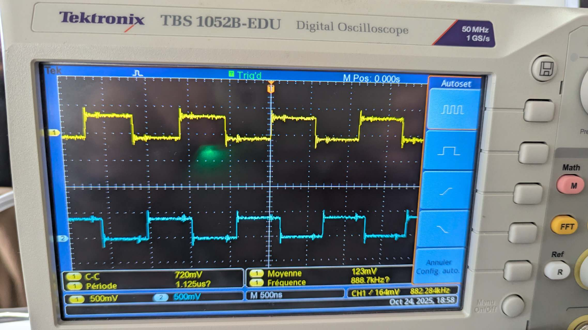
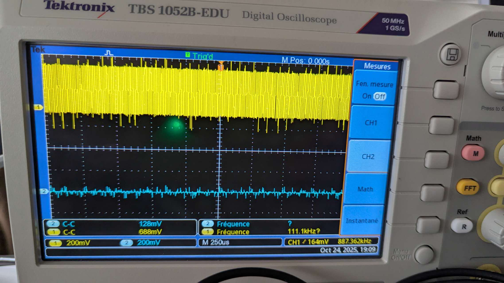
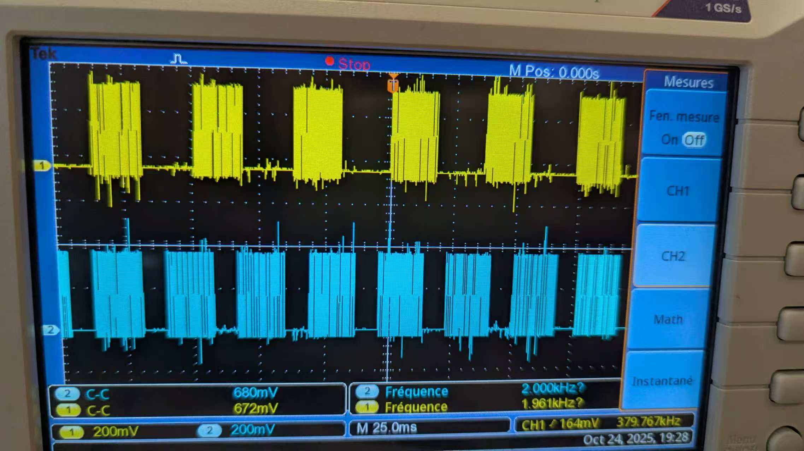
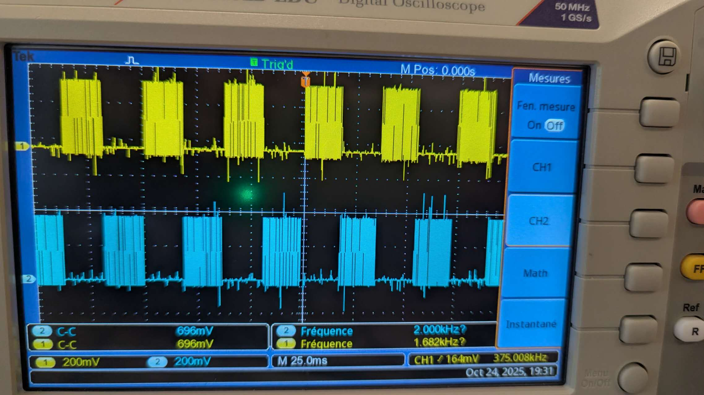
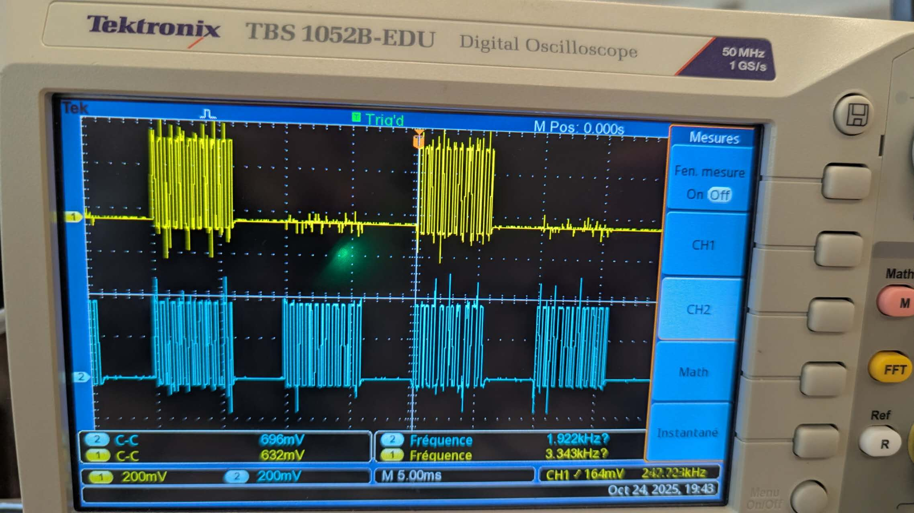
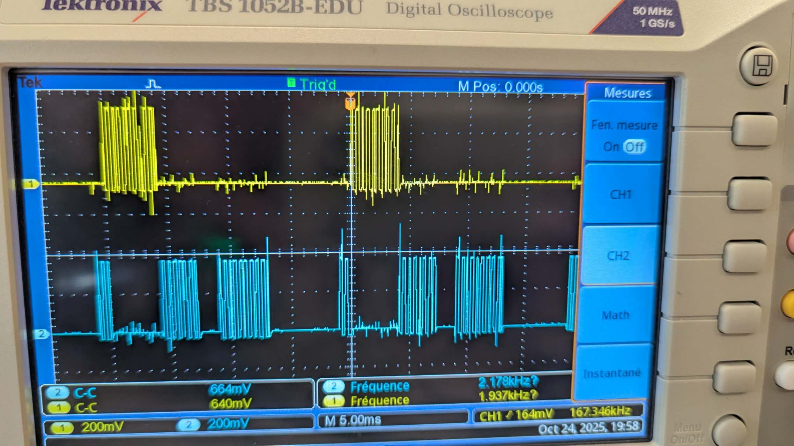
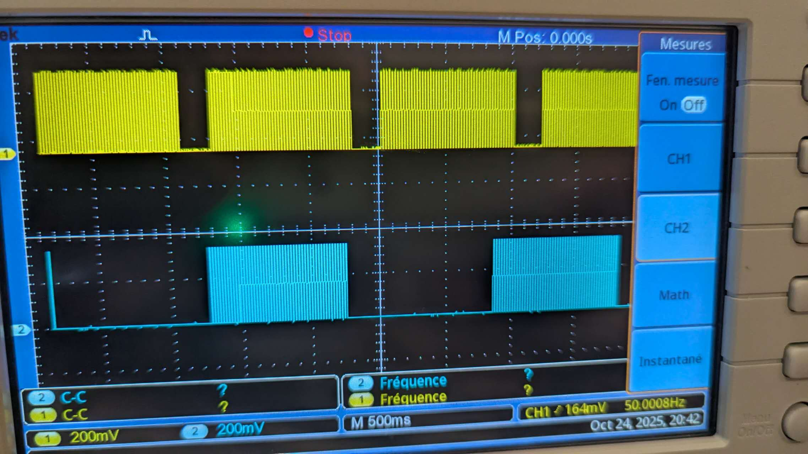
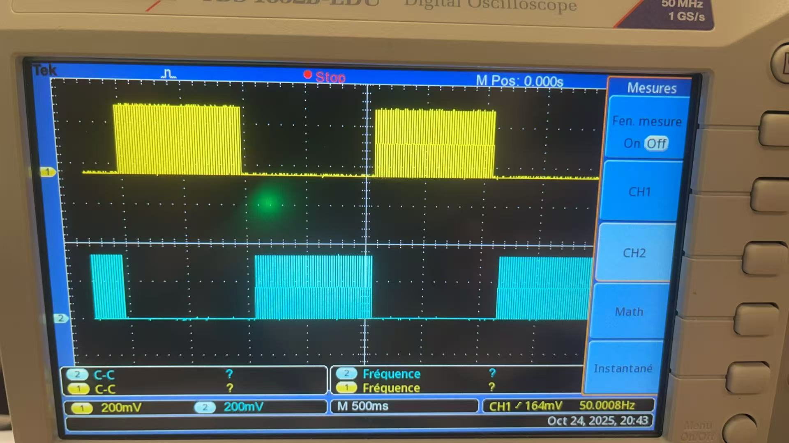
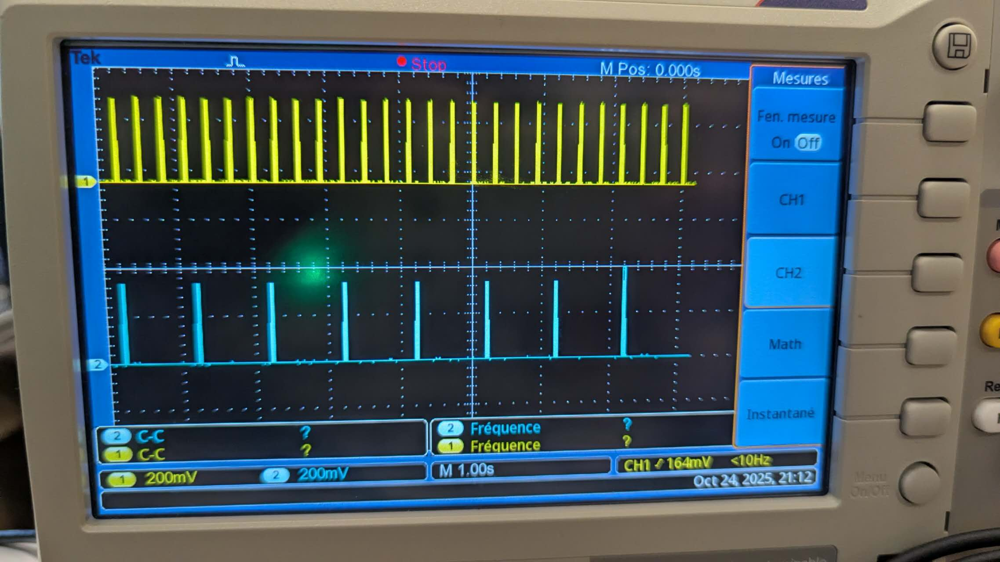

# FreeRTOS 多任务调度实验报告

本报告通过一系列实验探索了FreeRTOS在ESP32双核微控制器上的多任务调度机制，包括任务并发、优先级管理、周期性调度、任务同步、中断处理、队列通信以及会合点同步，系统地展示了实时操作系统的核心概念与应用。

---

## 2.1.1 Premier essai (Q21a)

### 代码分析

本实验使用 `xTaskCreate` 创建两个任务，每个任务不停翻转各自的GPIO引脚。Task1绑定到GPIO19，优先级为1；Task2绑定到GPIO23，优先级为10。由于使用的是 `xTaskCreate` 而非核心绑定的创建方式，FreeRTOS调度器将两个任务分配到ESP32的不同核心上运行。

### 图像分析



**图像观察**：示波器显示Pin 19和Pin 23都输出约1000kHz的方波信号。两个信号同时输出且频率相同，说明两个任务在不同核心上并行执行，互不干扰，即使优先级差距很大也不会出现抢占现象。

## 2.1.2 Deuxième essai (Q21b)

### 代码分析

本实验使用 `xTaskCreatePinnedToCore` 将两个任务都绑定到核心0，强制它们在同一个核心上竞争CPU时间。Task1优先级为1，Task2优先级为10。当两个任务运行在同一核心且优先级不同时，高优先级任务会持续占用CPU，导致低优先级任务几乎无法执行。只有当设置相同优先级时，系统才会让任务交替执行。

### 图像分析



**图像观察**：Pin 19的信号频率约为1000kHz，呈现密集的方波，而另一信号几乎是平直的线。这说明高优先级的Task会一直占用核心0，低优先级任务被"饿死"，几乎得不到执行机会。


**图像观察**：波形与第一次测试类似，进一步验证了单核环境下优先级抢占的效果。低优先级任务只能在高优先级任务极短暂的让出CPU瞬间勉强执行一点，波形上几乎看不到活动。

## 2.2.2a Premier essai (Q22a)

### 代码分析

本实验在Q21b基础上做了关键改进：将两个任务分别绑定到不同核心（Task1在核心0，Task2在核心1），并在每轮30000次翻转后加入延时（Task1延时10ms，Task2延时20ms）。多核分配消除了优先级抢占问题，而 `vTaskDelay` 的加入使任务周期性地让出CPU，实现了规律的"工作-休息"模式。

### 图像分析



**图像观察**：两个信号都呈现规律的脉冲串形态，黄色和蓝色信号都有明显的"工作-休息"节奏。由于两个任务运行在不同核心上，它们可以并行执行而互不干扰，即使优先级不同也都能正常运行。



**图像观察**：波形与第一次测试一致，进一步证明了 `vTaskDelay` 的作用。两个任务虽然优先级不同，但通过主动让出CPU实现了公平调度，避免了饿死现象。

## 2.2.2b Deuxième essai (Q22b)

### 代码分析

本实验用 `vTaskDelayUntil` 替换了 `vTaskDelay`，实现周期性任务调度。`vTaskDelayUntil` 能保证任务以精确的周期运行，不会因执行时间波动而累积误差。翻转次数减少到10000次，使每个工作周期更短。当nIteration=10000时，两个信号之间的时间差很难观察；但更改nIterations值后，可以明显看到Task2因Task1占用而产生的延迟，不过下一次信号周期保持不变，除非iteration过大导致信号重叠。

### 图像分析



**图像观察**：两个信号呈现非常规律的脉冲串，Task1（周期10ms）的脉冲更密集，Task2（周期20ms）的脉冲稍稀疏。周期性调度使得信号间隔均匀稳定，没有抖动或漂移现象。



**图像观察**：波形与第一次测试保持一致，验证了 `vTaskDelayUntil` 的精确周期控制能力。即使Task2因Task1的执行而延迟启动，其周期性仍然得到保证，体现了实时系统的可预测性。

## 2.3 Synchronisation et communication inter-tâches

### 2.3.2 Expérimentation 1 - 二进制信号量同步 (Q23a)

#### 代码分析

本实验演示了使用二进制信号量（Binary Semaphore）实现任务间的直接同步。程序创建了两个任务：
- **vTask1**：周期性任务，每10ms执行一次GPIO翻转操作，完成后通过 `xSemaphoreGive()` 释放信号量，相当于向Task2发送"我完成了"的信号
- **vTask2**：通过 `xSemaphoreTake()` 持续等待信号量，只有当Task1释放信号量后才能获取并执行自己的GPIO翻转操作

这种机制类似于"发令员-运动员"模型：Task1每完成一轮工作就挥旗发令，Task2看到旗语后才开始行动，从而确保Task2的动作总是发生在Task1的某个动作之后，实现了严格的执行顺序控制。

#### 图像分析


**图像观察**：示波器显示两个清晰的脉冲串信号。CH1（黄色）显示Task1的周期性脉冲，每个脉冲对应一次完整的GPIO翻转工作周期。CH2（蓝色）显示Task2的脉冲，其脉冲的出现总是紧随在Task1的脉冲之后，存在明显的时序依赖关系。两个信号之间可以观察到固定的时间延迟，这正是信号量同步机制的体现。

**同步效果分析**：从波形可以看出，Task2从不会在Task1之前执行，也不会与Task1并行执行。每当Task1完成一个工作周期并释放信号量后，Task2立即被唤醒并开始执行，完成后再次进入等待状态。这种"等待-唤醒-执行-等待"的循环确保了两个任务之间的严格同步，体现了二进制信号量在任务协作中的作用。

### 2.3.3 Expérimentation 2 - 互斥锁保护共享资源 (Q23b)

#### 代码分析

本实验演示了多任务环境下共享资源的竞态条件（Race Condition）问题及其解决方案。程序创建了两个任务vTask1和vTask2，它们都会调用同一个 `alternate()` 函数来操作GPIO输出。这个函数被视为"共享资源"，如果两个任务同时访问，会导致输出波形混乱。

实验分为两个阶段：
1. **第一阶段**：互斥锁的 `xSemaphoreTake()` 和 `xSemaphoreGive()` 被注释，两个任务可以无序地访问共享资源
2. **第二阶段**：取消注释互斥锁代码，每个任务在进入临界区前必须先获取互斥锁，使用完后释放，确保同一时刻只有一个任务能访问共享资源

#### 图像分析 - 第一阶段（无互斥锁保护）



**图像观察**：示波器显示的波形呈现出明显的混乱特征。CH1（黄色）的脉冲串内部出现了密度不均匀的情况，部分区域的脉冲明显稀疏。CH2（蓝色）的脉冲分布也很不规律，时而密集时而稀疏。两个信号在时间上出现了重叠和交错，无法形成清晰的工作周期划分。

**竞态条件分析**：这种混乱的波形正是竞态条件的典型表现。当两个任务几乎同时调用 `alternate()` 函数时，它们的GPIO操作会相互干扰。例如，Task1可能刚将引脚置高，Task2就将其置低，导致预期的翻转周期被打乱。从波形上看，原本应该规律的脉冲变得不可预测，证明了在没有同步机制的情况下，共享资源访问是不安全的。

#### 图像分析 - 第二阶段（互斥锁保护）



**图像观察**：添加互斥锁保护后，波形发生了显著变化。CH1（黄色）和CH2（蓝色）的脉冲串都变得非常规律和密集，每个脉冲宽度一致，间隔均匀。两个信号呈现出明显的"轮流工作"模式：在某个时间段内CH1活跃，随后CH2活跃，它们之间不再有重叠或交错现象。整体波形呈现出清晰的周期性和可预测性。

**互斥效果分析**：互斥锁成功地将并发访问转变为串行访问。当Task1获取互斥锁并进入 `alternate()` 函数的临界区时，Task2即使准备就绪也必须等待。只有当Task1完成工作并释放互斥锁后，Task2才能获取锁并进入临界区。这种"排队等待"机制消除了竞态条件，确保了每个任务都能完整地执行其GPIO操作而不被打断，波形因此变得有序。

#### 对比总结

| 特征 | 无互斥锁保护（第一阶段） | 互斥锁保护（第二阶段） |
|------|------------------------|---------------------|
| 波形规律性 | 混乱、不可预测 | 规律、周期性强 |
| 任务执行方式 | 并发访问、相互干扰 | 串行访问、互不干扰 |
| 共享资源安全性 | 不安全、存在竞态条件 | 安全、临界区受保护 |
| 系统可靠性 | 低、输出不确定 | 高、输出确定可控 |

**修改的作用**：取消互斥锁代码的注释实现了对共享资源的互斥访问保护。互斥锁确保了临界区代码的原子性执行，防止了多任务环境下的数据竞争和不一致问题，这是多任务编程中保证系统正确性的基本手段。

### 2.3.4 Expérimentation 3 - 优先级反转与优先级继承 (Q23c)

#### 代码分析

本实验演示了实时系统中一个重要且危险的问题：**优先级反转**（Priority Inversion），以及FreeRTOS通过**优先级继承**（Priority Inheritance）机制来解决这一问题的方法。

程序创建了三个任务，全部运行在核心0上：
- **vTaskBasse**（低优先级，优先级1）：需要访问共享资源，执行时间较长
- **vTaskInter**（中等优先级，优先级5）：不访问共享资源，但会抢占低优先级任务
- **vTaskHaute**（高优先级，优先级10）：需要访问与低优先级任务相同的共享资源

实验分为两个阶段：
1. **第一阶段**：使用二进制信号量 `xSemaphoreCreateBinary()` 作为锁机制
2. **第二阶段**：改用互斥锁 `xSemaphoreCreateMutex()`，启用优先级继承

#### Serial Monitor输出 - 第一阶段（Binary Semaphore）

```
Travaille sur : BASSE_PARTAGEE
La tâche priorité BASSE a fini son travail avec la ressource partagée
La tâche priorité BASSE a fini son travail en : 2187 ms
La tâche priorité HAUTE accède à la ressource partagée
Travaille sur : HAUTE_PARTAGEE
...
La tâche priorité HAUTE a fini son travail en : 1915 ms
Travaille sur : INTERMEDIAIRE
La tâche priorité HAUTE souhaite acceder à la ressource partagée
Travaille sur : INTERMEDIAIRE
Travaille sur : INTERMEDIAIRE
Travaille sur : INTERMEDIAIRE
Travaille sur : INTERMEDIAIRE
Travaille sur : INTERMEDIAIRE
La tâche priorité INTERMEDIAIRE a fini son travail en : 1214 ms
Travaille sur : BASSE_PARTAGEE
...
```

**执行流程分析**：

1. **初始阶段**：低优先级任务获取信号量并开始访问共享资源（"BASSE_PARTAGEE"），耗时2187ms
2. **第一次高优先级任务**：当低优先级任务释放资源后，高优先级任务立即获取并执行，耗时1915ms
3. **关键问题出现**：当高优先级任务再次想访问共享资源时（"La tâche priorité HAUTE souhaite acceder à la ressource partagée"），此时低优先级任务正持有信号量，但中等优先级任务（INTERMEDIAIRE）因其优先级高于低优先级任务而抢占CPU
4. **优先级反转**：高优先级任务必须等待中等优先级任务完成（1214ms），然后再等待低优先级任务完成（2187ms），总等待时间超过3400ms。实际上，高优先级任务被两个较低优先级的任务阻塞了！

**问题本质**：二进制信号量不支持优先级继承。当高优先级任务等待锁时，持有锁的低优先级任务的优先级不会提升，因此会被中等优先级任务抢占，导致高优先级任务的等待时间被不必要地延长。

#### Serial Monitor输出 - 第二阶段（Mutex with Priority Inheritance）

```
Travaille sur : INTERMEDIAIRE
La tâche priorité HAUTE souhaite acceder à la ressource partagée
Travaille sur : BASSE_PARTAGEE
Travaille sur : BASSE_PARTAGEE
Travaille sur : BASSE_PARTAGEE
Travaille sur : BASSE_PARTAGEE
Travaille sur : BASSE_PARTAGEE
La tâche priorité BASSE a fini son travail avec la ressource partagée
La tâche priorité BASSE a fini son travail en : 1472 ms
La tâche priorité HAUTE accède à la ressource partagée
Travaille sur : HAUTE_PARTAGEE
...
La tâche priorité HAUTE a fini son travail en : 1200 ms
Travaille sur : INTERMEDIAIRE
Travaille sur : INTERMEDIAIRE
...
La tâche priorité INTERMEDIAIRE a fini son travail en : 2405 ms
```

**执行流程分析**：

1. **中等优先级任务开始**：INTERMEDIAIRE任务开始执行
2. **高优先级任务请求资源**：高优先级任务想访问共享资源，但此时低优先级任务持有互斥锁
3. **优先级继承生效**：关键变化！当高优先级任务阻塞在互斥锁上时，系统自动将低优先级任务的优先级临时提升到与高优先级任务相同（优先级10）
4. **低优先级任务继续执行**：由于优先级被提升，低优先级任务不再被中等优先级任务抢占，可以连续执行完成其临界区代码（"BASSE_PARTAGEE"连续出现5次），耗时1472ms
5. **高优先级任务立即执行**：低优先级任务释放锁后，高优先级任务立即获取并执行，耗时1200ms
6. **中等优先级任务恢复**：最后中等优先级任务继续执行完成，耗时2405ms

**优化效果**：高优先级任务的总等待时间从3400ms降低到约1472ms，减少了约57%的延迟！

#### 对比总结

| 特征 | Binary Semaphore（第一阶段） | Mutex with Priority Inheritance（第二阶段） |
|------|---------------------------|----------------------------------------|
| 优先级继承 | 不支持 | 支持 |
| 高优先级任务等待时间 | ~3400ms（INTER+BASSE） | ~1472ms（仅BASSE） |
| 低优先级任务执行 | 被中等优先级任务频繁抢占 | 继承高优先级后连续执行 |
| 中等优先级任务行为 | 在低优先级任务持有锁时抢占 | 在低优先级继承高优先级后被阻塞 |
| 优先级反转问题 | 严重（高优先级形同虚设） | 已解决（高优先级得到保障） |
| 系统实时性 | 差、不可预测 | 好、符合优先级设计 |

#### 代码修改说明

**修改内容**：在 `setup()` 函数中，将
```cpp
xSemaphore = xSemaphoreCreateBinary();
```
替换为
```cpp
xSemaphore = xSemaphoreCreateMutex();
```

**修改的作用**：

1. **语义层面**：互斥锁（Mutex）明确表示其用途是保护共享资源的互斥访问，而二进制信号量更多用于任务同步信号传递，使用正确的同步原语能提高代码可读性和维护性

2. **功能层面**：互斥锁内置了优先级继承协议。当高优先级任务因等待互斥锁而阻塞时，内核会自动将持有锁的低优先级任务的优先级临时提升至等待任务的最高优先级，确保低优先级任务能尽快完成临界区代码并释放锁

3. **实时性保障**：优先级继承机制防止了优先级反转问题，确保了高优先级任务的响应时间符合预期，这对实时系统的可预测性和可靠性至关重要

4. **资源利用**：通过减少高优先级任务的阻塞时间，系统整体的响应性能和资源利用效率都得到提升

**结论**：在多任务实时系统中，当需要保护共享资源时，应优先使用互斥锁而非二进制信号量，以避免优先级反转问题。这是实时操作系统设计的重要原则之一。

## 2.4 中断与任务协作 (Q24)

### 2.4.1 代码分析

本实验演示了硬件中断与任务之间的协作机制。程序创建了两个任务和一个中断服务例程。系统使用二进制信号量来连接中断和任务。

**硬件连接**：
- GPIO12（输出引脚）通过导线连接到GPIO5（中断输入引脚）
- 程序在setup中每隔300ms翻转GPIO12的状态
- GPIO5检测到电平变化时触发中断

**任务配置**：
- **vTask1**：运行在核心0，优先级20，每1000ms执行一次GPIO翻转（10次迭代，每次5ms）
- **vTask2**：运行在核心1，优先级10，等待信号量被释放后执行GPIO翻转

**工作流程**：
1. setup函数进入无限循环，每300ms翻转GPIO12的输出
2. GPIO5检测到电平变化（上升沿或下降沿），触发中断例程
3. 中断例程调用 `xSemaphoreGiveFromISR()` 释放信号量
4. Task2通过 `xSemaphoreTake()` 获取信号量，被唤醒并执行工作
5. Task1独立运行，不受中断系统影响

### 2.4.2 图像分析



**图像观察**：
- **CH1（黄色，Task1）**：显示规律的脉冲串，每个脉冲串宽度约100ms（10次×10ms），间隔1秒
- **CH2（蓝色，Task2）**：显示更密集的脉冲，出现频率约为每150ms一次
- **时间刻度**：1秒/格（1.00s/div）

**执行时序分析**：

GPIO12每300ms翻转一次状态。中断触发模式设置为 `CHANGE`（电平变化触发）。这意味着每300ms会产生两次中断事件：
- t=0ms：GPIO12从低到高，触发上升沿中断
- t=150ms：经过半个周期
- t=300ms：GPIO12从高到低，触发下降沿中断
- t=450ms：经过半个周期
- t=600ms：GPIO12从低到高，再次触发中断

因此Task2实际上每150ms左右被唤醒一次。波形上看到的密集脉冲验证了这个时序。

### 2.4.3 Serial Monitor输出

```
[INFO] current=1 et in=1
[INFO] interruptRoutine()
[INFO] vTask2 called
[INFO] current=0 et in=0
[INFO] interruptRoutine()
[INFO] vTask2 called
[INFO] current=1 et in=1
[INFO] interruptRoutine()
[INFO] vTask2 called
```

**输出分析**：

每次GPIO12状态改变（current值变化），系统立即打印三条信息：
1. `current=X et in=X`：显示输出状态和输入检测状态一致
2. `[INFO] interruptRoutine()`：中断例程被触发
3. `[INFO] vTask2 called`：Task2被唤醒并开始执行

这三条信息紧密相连。它们说明了电平变化、中断触发、任务唤醒这个过程是连续的。

### 2.4.4 工作原理总结

**中断服务例程的设计原则**：

中断例程必须尽快执行完成。它不能包含复杂的处理逻辑。因此最佳做法是：
1. 中断例程只负责释放信号量
2. 真正的工作放在普通任务中完成
3. 任务通过等待信号量的方式被中断唤醒

**优先级与核心分配**：

Task1优先级（20）高于Task2（10）。但这个差异不会造成问题。原因是两个任务运行在不同核心上。Task1在核心0，Task2在核心1。它们各自独立运行，互不干扰。

**中断响应机制的意义**：

嵌入式系统需要响应外部事件。这些事件的发生时间无法预测。中断机制让CPU能够立即响应这些事件。信号量则将中断的通知传递给任务，让任务在合适的时候处理事件。

## 2.5 队列通信 (Q25)

### 2.5.1 代码分析

本实验演示了多个生产者和一个消费者之间的队列通信。程序创建了两个发送任务和一个接收任务。它们通过队列进行数据交换。

**队列配置**：
- 队列容量：5个元素（`TAILLE_MAX = 5`）
- 数据类型：整数（`sizeof(int)`）
- 创建函数：`xQueueCreate(TAILLE_MAX, sizeof(int))`

**任务配置**：
- **vSenderTask（Sender1）**：优先级1，发送固定值100
- **vSenderTask（Sender2）**：优先级1，发送固定值200
- **vReceiverTask（Receiver）**：优先级2，接收并打印数据

**工作流程**：
1. 两个发送任务持续调用 `xQueueSendToBack()` 发送数据，超时时间为0
2. 如果队列未满，发送成功并打印"envoyé = X"
3. 如果队列已满，打印"envoyé = aucun"
4. 接收任务调用 `uxQueueMessagesWaiting()` 查看队列元素数量
5. 接收任务调用 `xQueueReceive()` 读取数据，超时时间100ms
6. 如果队列有数据，打印"lu = X"；否则打印"lu = aucun"

### 2.5.2 Serial Monitor输出

```
vSenderTask - envoyé = 100 (priorite 1)
vReceiverTask - lu = 100 (priorite 2)
vReceiverTask - nb elements = 0 (priorite 2)
vSenderTask - envoyé = 100 (priorite 1)
vSenderTask - envoyé = 200 (priorite 1)
vReceiverTask - lu = 100 (priorite 2)
vReceiverTask - nb elements = 1 (priorite 2)
vReceiverTask - lu = 200 (priorite 2)
vReceiverTask - nb elements = 0 (priorite 2)
vSenderTask - envoyé = 200 (priorite 1)
vReceiverTask - lu = 200 (priorite 2)
```

**输出分析**：

接收任务的优先级（2）高于发送任务（1）。这意味着只要队列中有数据，接收任务就会立即被唤醒并抢占发送任务。从输出可以看到：
1. 当队列为空（nb elements = 0）时，两个发送任务竞争CPU
2. 一旦有数据入队，接收任务立即抢占并读取数据
3. 队列大部分时间保持在0或1个元素

### 2.5.3 优先级与调度分析

**接收任务优先级更高的原因**：

接收任务优先级（2）高于发送任务（1）。这个设计保证了数据能够及时被处理。如果接收任务优先级低，队列可能很快被填满，导致发送任务阻塞或丢失数据。

**队列的缓冲作用**：

队列容量为5。即使接收任务短时间内无法处理数据，队列可以暂存最多5个数据。这提供了一定的容错能力。从输出看，队列元素数量在0-1之间波动，说明接收速度足够快。

### 2.5.4 总结

队列是FreeRTOS中实现任务间通信的重要机制。本实验展示了多生产者单消费者模式。队列提供了线程安全的数据传递，配合优先级机制可以实现高效的数据流控制。

## 2.6 任务会合点同步 (Q26)

### 2.6.1 实验要求

本实验要求实现三个任务之间的会合点（rendez-vous）同步机制。任务1和任务2并行执行各自的工作，任务3必须等待前两个任务都完成后才能开始执行。

### 2.6.2 代码实现

程序使用计数信号量 `xSemaphoreCreateCounting(2, 0)` 来实现同步。任务1和任务2完成工作后各自调用 `xSemaphoreGive()` 释放信号量，任务3连续调用两次 `xSemaphoreTake()` 来等待前两个任务的完成信号。三个任务分别绑定到GPIO引脚（23、19、18），可以通过示波器观察它们的执行顺序。

### 2.6.3 总结

计数信号量提供了灵活的多任务同步机制。这种会合点模式适用于需要汇总多个并行任务结果的场景，比如多传感器数据融合或分布式计算中的同步点。

---

## 总结

通过本次实验，我们系统掌握了FreeRTOS的核心机制：从多核并行与优先级抢占理解了任务调度的本质，通过延时函数实现了精确的周期性控制，利用信号量、互斥锁和队列解决了任务同步与通信问题，并通过中断机制实现了对外部事件的实时响应，这些技术构成了嵌入式实时系统开发的基础。
