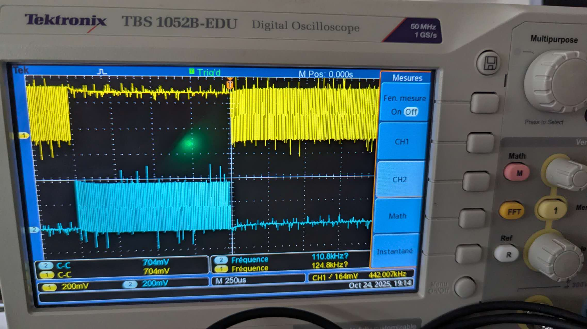
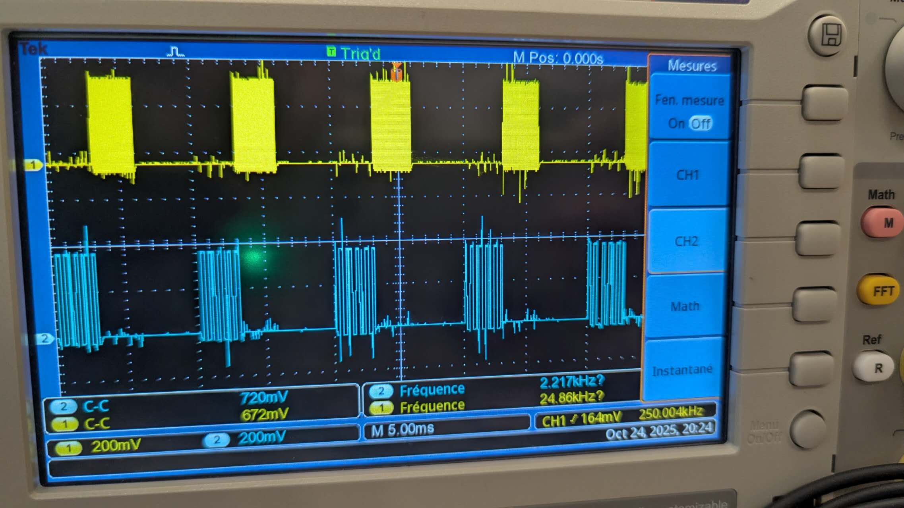

# FreeRTOS 多任务调度实验报告

## 2.1.1 Premier essai (Q21a)

### 代码分析

本实验使用 `xTaskCreate` 创建两个任务，每个任务不停翻转各自的GPIO引脚。Task1绑定到GPIO19，优先级为1；Task2绑定到GPIO23，优先级为10。由于使用的是 `xTaskCreate` 而非核心绑定的创建方式，FreeRTOS调度器将两个任务分配到ESP32的不同核心上运行。

### 图像分析


**图像观察**：示波器显示Pin 19和Pin 23都输出约1000kHz的方波信号。两个信号同时输出且频率相同，说明两个任务在不同核心上并行执行，互不干扰，即使优先级差距很大也不会出现抢占现象。

## 2.1.2 Deuxième essai (Q21b)

### 代码分析

本实验使用 `xTaskCreatePinnedToCore` 将两个任务都绑定到核心0，强制它们在同一个核心上竞争CPU时间。Task1优先级为1，Task2优先级为10。当两个任务运行在同一核心且优先级不同时，高优先级任务会持续占用CPU，导致低优先级任务几乎无法执行。只有当设置相同优先级时，系统才会让任务交替执行。

### 图像分析


**图像观察**：Pin 19的信号频率约为1000kHz，呈现密集的方波，而另一信号几乎是平直的线。这说明高优先级的Task会一直占用核心0，低优先级任务被"饿死"，几乎得不到执行机会。



**图像观察**：波形与第一次测试类似，进一步验证了单核环境下优先级抢占的效果。低优先级任务只能在高优先级任务极短暂的让出CPU瞬间勉强执行一点，波形上几乎看不到活动。

## 2.2.2a Premier essai (Q22a)

### 代码分析

本实验在Q21b基础上做了关键改进：将两个任务分别绑定到不同核心（Task1在核心0，Task2在核心1），并在每轮30000次翻转后加入延时（Task1延时10ms，Task2延时20ms）。多核分配消除了优先级抢占问题，而 `vTaskDelay` 的加入使任务周期性地让出CPU，实现了规律的"工作-休息"模式。

### 图像分析


**图像观察**：两个信号都呈现规律的脉冲串形态，黄色和蓝色信号都有明显的"工作-休息"节奏。由于两个任务运行在不同核心上，它们可以并行执行而互不干扰，即使优先级不同也都能正常运行。


**图像观察**：波形与第一次测试一致，进一步证明了 `vTaskDelay` 的作用。两个任务虽然优先级不同，但通过主动让出CPU实现了公平调度，避免了饿死现象。

## 2.2.2b Deuxième essai (Q22b)

### 代码分析

本实验用 `vTaskDelayUntil` 替换了 `vTaskDelay`，实现周期性任务调度。`vTaskDelayUntil` 能保证任务以精确的周期运行，不会因执行时间波动而累积误差。翻转次数减少到10000次，使每个工作周期更短。当nIteration=10000时，两个信号之间的时间差很难观察；但更改nIterations值后，可以明显看到Task2因Task1占用而产生的延迟，不过下一次信号周期保持不变，除非iteration过大导致信号重叠。

### 图像分析


**图像观察**：两个信号呈现非常规律的脉冲串，Task1（周期10ms）的脉冲更密集，Task2（周期20ms）的脉冲稍稀疏。周期性调度使得信号间隔均匀稳定，没有抖动或漂移现象。


**图像观察**：波形与第一次测试保持一致，验证了 `vTaskDelayUntil` 的精确周期控制能力。即使Task2因Task1的执行而延迟启动，其周期性仍然得到保证，体现了实时系统的可预测性。

## 2.3 Synchronisation et communication inter-tâches

### 2.3.2 Expérimentation 1 - 二进制信号量同步 (Q23a)

#### 代码分析

本实验演示了使用二进制信号量（Binary Semaphore）实现任务间的直接同步。程序创建了两个任务：
- **vTask1**：周期性任务，每10ms执行一次GPIO翻转操作，完成后通过 `xSemaphoreGive()` 释放信号量，相当于向Task2发送"我完成了"的信号
- **vTask2**：通过 `xSemaphoreTake()` 持续等待信号量，只有当Task1释放信号量后才能获取并执行自己的GPIO翻转操作

这种机制类似于"发令员-运动员"模型：Task1每完成一轮工作就挥旗发令，Task2看到旗语后才开始行动，从而确保Task2的动作总是发生在Task1的某个动作之后，实现了严格的执行顺序控制。

#### 图像分析



**图像观察**：示波器显示两个清晰的脉冲串信号。CH1（黄色）显示Task1的周期性脉冲，每个脉冲对应一次完整的GPIO翻转工作周期。CH2（蓝色）显示Task2的脉冲，其脉冲的出现总是紧随在Task1的脉冲之后，存在明显的时序依赖关系。两个信号之间可以观察到固定的时间延迟，这正是信号量同步机制的体现。

**同步效果分析**：从波形可以看出，Task2从不会在Task1之前执行，也不会与Task1并行执行。每当Task1完成一个工作周期并释放信号量后，Task2立即被唤醒并开始执行，完成后再次进入等待状态。这种"等待-唤醒-执行-等待"的循环确保了两个任务之间的严格同步，体现了二进制信号量在任务协作中的作用。

### 2.3.3 Expérimentation 2 - 互斥锁保护共享资源 (Q23b)

#### 代码分析

本实验演示了多任务环境下共享资源的竞态条件（Race Condition）问题及其解决方案。程序创建了两个任务vTask1和vTask2，它们都会调用同一个 `alternate()` 函数来操作GPIO输出。这个函数被视为"共享资源"，如果两个任务同时访问，会导致输出波形混乱。

实验分为两个阶段：
1. **第一阶段**：互斥锁的 `xSemaphoreTake()` 和 `xSemaphoreGive()` 被注释，两个任务可以无序地访问共享资源
2. **第二阶段**：取消注释互斥锁代码，每个任务在进入临界区前必须先获取互斥锁，使用完后释放，确保同一时刻只有一个任务能访问共享资源

#### 图像分析 - 第一阶段（无互斥锁保护）


**图像观察**：示波器显示的波形呈现出明显的混乱特征。CH1（黄色）的脉冲串内部出现了密度不均匀的情况，部分区域的脉冲明显稀疏。CH2（蓝色）的脉冲分布也很不规律，时而密集时而稀疏。两个信号在时间上出现了重叠和交错，无法形成清晰的工作周期划分。

**竞态条件分析**：这种混乱的波形正是竞态条件的典型表现。当两个任务几乎同时调用 `alternate()` 函数时，它们的GPIO操作会相互干扰。例如，Task1可能刚将引脚置高，Task2就将其置低，导致预期的翻转周期被打乱。从波形上看，原本应该规律的脉冲变得不可预测，证明了在没有同步机制的情况下，共享资源访问是不安全的。

#### 图像分析 - 第二阶段（互斥锁保护）


**图像观察**：添加互斥锁保护后，波形发生了显著变化。CH1（黄色）和CH2（蓝色）的脉冲串都变得非常规律和密集，每个脉冲宽度一致，间隔均匀。两个信号呈现出明显的"轮流工作"模式：在某个时间段内CH1活跃，随后CH2活跃，它们之间不再有重叠或交错现象。整体波形呈现出清晰的周期性和可预测性。

**互斥效果分析**：互斥锁成功地将并发访问转变为串行访问。当Task1获取互斥锁并进入 `alternate()` 函数的临界区时，Task2即使准备就绪也必须等待。只有当Task1完成工作并释放互斥锁后，Task2才能获取锁并进入临界区。这种"排队等待"机制消除了竞态条件，确保了每个任务都能完整地执行其GPIO操作而不被打断，波形因此变得有序。

#### 对比总结

| 特征 | 无互斥锁保护（第一阶段） | 互斥锁保护（第二阶段） |
|------|------------------------|---------------------|
| 波形规律性 | 混乱、不可预测 | 规律、周期性强 |
| 任务执行方式 | 并发访问、相互干扰 | 串行访问、互不干扰 |
| 共享资源安全性 | 不安全、存在竞态条件 | 安全、临界区受保护 |
| 系统可靠性 | 低、输出不确定 | 高、输出确定可控 |

**修改的作用**：取消互斥锁代码的注释实现了对共享资源的互斥访问保护。互斥锁确保了临界区代码的原子性执行，防止了多任务环境下的数据竞争和不一致问题，这是多任务编程中保证系统正确性的基本手段。

### 2.3.4 Expérimentation 3 - 优先级反转与优先级继承 (Q23c)

#### 代码分析

本实验演示了实时系统中一个重要且危险的问题：**优先级反转**（Priority Inversion），以及FreeRTOS通过**优先级继承**（Priority Inheritance）机制来解决这一问题的方法。

程序创建了三个任务，全部运行在核心0上：
- **vTaskBasse**（低优先级，优先级1）：需要访问共享资源，执行时间较长
- **vTaskInter**（中等优先级，优先级5）：不访问共享资源，但会抢占低优先级任务
- **vTaskHaute**（高优先级，优先级10）：需要访问与低优先级任务相同的共享资源

实验分为两个阶段：
1. **第一阶段**：使用二进制信号量 `xSemaphoreCreateBinary()` 作为锁机制
2. **第二阶段**：改用互斥锁 `xSemaphoreCreateMutex()`，启用优先级继承

#### Serial Monitor输出 - 第一阶段（Binary Semaphore）

```
Travaille sur : BASSE_PARTAGEE
La tâche priorité BASSE a fini son travail avec la ressource partagée
La tâche priorité BASSE a fini son travail en : 2187 ms
La tâche priorité HAUTE accède à la ressource partagée
Travaille sur : HAUTE_PARTAGEE
...
La tâche priorité HAUTE a fini son travail en : 1915 ms
Travaille sur : INTERMEDIAIRE
La tâche priorité HAUTE souhaite acceder à la ressource partagée
Travaille sur : INTERMEDIAIRE
Travaille sur : INTERMEDIAIRE
Travaille sur : INTERMEDIAIRE
Travaille sur : INTERMEDIAIRE
Travaille sur : INTERMEDIAIRE
La tâche priorité INTERMEDIAIRE a fini son travail en : 1214 ms
Travaille sur : BASSE_PARTAGEE
...
```

**执行流程分析**：

1. **初始阶段**：低优先级任务获取信号量并开始访问共享资源（"BASSE_PARTAGEE"），耗时2187ms
2. **第一次高优先级任务**：当低优先级任务释放资源后，高优先级任务立即获取并执行，耗时1915ms
3. **关键问题出现**：当高优先级任务再次想访问共享资源时（"La tâche priorité HAUTE souhaite acceder à la ressource partagée"），此时低优先级任务正持有信号量，但中等优先级任务（INTERMEDIAIRE）因其优先级高于低优先级任务而抢占CPU
4. **优先级反转**：高优先级任务必须等待中等优先级任务完成（1214ms），然后再等待低优先级任务完成（2187ms），总等待时间超过3400ms。实际上，高优先级任务被两个较低优先级的任务阻塞了！

**问题本质**：二进制信号量不支持优先级继承。当高优先级任务等待锁时，持有锁的低优先级任务的优先级不会提升，因此会被中等优先级任务抢占，导致高优先级任务的等待时间被不必要地延长。

#### Serial Monitor输出 - 第二阶段（Mutex with Priority Inheritance）

```
Travaille sur : INTERMEDIAIRE
La tâche priorité HAUTE souhaite acceder à la ressource partagée
Travaille sur : BASSE_PARTAGEE
Travaille sur : BASSE_PARTAGEE
Travaille sur : BASSE_PARTAGEE
Travaille sur : BASSE_PARTAGEE
Travaille sur : BASSE_PARTAGEE
La tâche priorité BASSE a fini son travail avec la ressource partagée
La tâche priorité BASSE a fini son travail en : 1472 ms
La tâche priorité HAUTE accède à la ressource partagée
Travaille sur : HAUTE_PARTAGEE
...
La tâche priorité HAUTE a fini son travail en : 1200 ms
Travaille sur : INTERMEDIAIRE
Travaille sur : INTERMEDIAIRE
...
La tâche priorité INTERMEDIAIRE a fini son travail en : 2405 ms
```

**执行流程分析**：

1. **中等优先级任务开始**：INTERMEDIAIRE任务开始执行
2. **高优先级任务请求资源**：高优先级任务想访问共享资源，但此时低优先级任务持有互斥锁
3. **优先级继承生效**：关键变化！当高优先级任务阻塞在互斥锁上时，系统自动将低优先级任务的优先级临时提升到与高优先级任务相同（优先级10）
4. **低优先级任务继续执行**：由于优先级被提升，低优先级任务不再被中等优先级任务抢占，可以连续执行完成其临界区代码（"BASSE_PARTAGEE"连续出现5次），耗时1472ms
5. **高优先级任务立即执行**：低优先级任务释放锁后，高优先级任务立即获取并执行，耗时1200ms
6. **中等优先级任务恢复**：最后中等优先级任务继续执行完成，耗时2405ms

**优化效果**：高优先级任务的总等待时间从3400ms降低到约1472ms，减少了约57%的延迟！

#### 对比总结

| 特征 | Binary Semaphore（第一阶段） | Mutex with Priority Inheritance（第二阶段） |
|------|---------------------------|----------------------------------------|
| 优先级继承 | 不支持 | 支持 |
| 高优先级任务等待时间 | ~3400ms（INTER+BASSE） | ~1472ms（仅BASSE） |
| 低优先级任务执行 | 被中等优先级任务频繁抢占 | 继承高优先级后连续执行 |
| 中等优先级任务行为 | 在低优先级任务持有锁时抢占 | 在低优先级继承高优先级后被阻塞 |
| 优先级反转问题 | 严重（高优先级形同虚设） | 已解决（高优先级得到保障） |
| 系统实时性 | 差、不可预测 | 好、符合优先级设计 |

#### 代码修改说明

**修改内容**：在 `setup()` 函数中，将
```cpp
xSemaphore = xSemaphoreCreateBinary();
```
替换为
```cpp
xSemaphore = xSemaphoreCreateMutex();
```

**修改的作用**：

1. **语义层面**：互斥锁（Mutex）明确表示其用途是保护共享资源的互斥访问，而二进制信号量更多用于任务同步信号传递，使用正确的同步原语能提高代码可读性和维护性

2. **功能层面**：互斥锁内置了优先级继承协议。当高优先级任务因等待互斥锁而阻塞时，内核会自动将持有锁的低优先级任务的优先级临时提升至等待任务的最高优先级，确保低优先级任务能尽快完成临界区代码并释放锁

3. **实时性保障**：优先级继承机制防止了优先级反转问题，确保了高优先级任务的响应时间符合预期，这对实时系统的可预测性和可靠性至关重要

4. **资源利用**：通过减少高优先级任务的阻塞时间，系统整体的响应性能和资源利用效率都得到提升

**结论**：在多任务实时系统中，当需要保护共享资源时，应优先使用互斥锁而非二进制信号量，以避免优先级反转问题。这是实时操作系统设计的重要原则之一。
